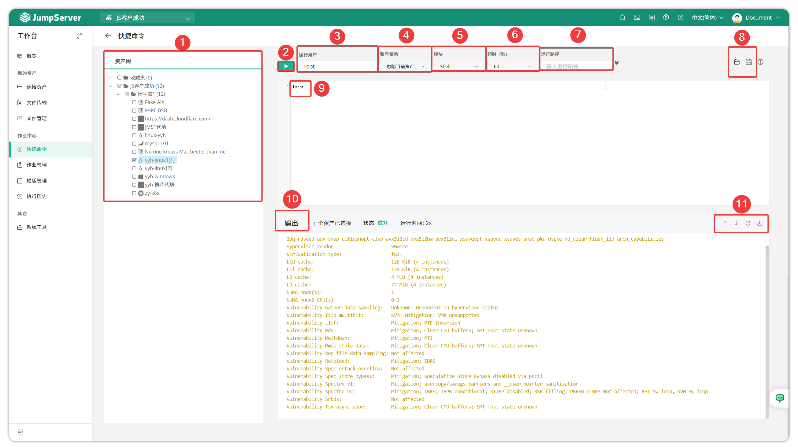

# Quick Commands

!!! warning "Note: In v4.0, Job Center is disabled by default. System administrators need to enable it at **System Settings > Feature Settings > Job Center**."

!!! tip ""
    - Enter the **Workbench** page, click **Job Center > Quick Commands** to open the quick commands page.
    - Quick Commands allows batch command execution on assets that users have permission for. Select assets to execute quick commands in the asset tree, and select account information, timeout settings, etc.

!!! tip ""
    - Detailed module description:

    | No. | Name | Description |
    | --- | --- | --- |
    | 1 | Asset Tree | Select assets to execute commands on. |
    | 2 | Run | Button to run commands. |
    | 3 | Run User | User on target asset running the command. |
    | 4 | Account Policy | ● Ignore Current Asset ● Prefer Privileged Accounts ● Privileged Accounts Only |
    | 5 | Language | Currently supported language types: Shell, PowerShell, Raw, Python, MySQL, PostgreSQL, SQL Server. |
    | 6 | Timeout (Sec) | Command execution timeout; currently supports: 10, 30, 60 seconds. |
    | 7 | Run Path | Directory for executing the quick command. |
    | 8 | Open Command/Save Command | Open commands from template management module/Save current command to template management module. |
    | 9 | Command Input Area | Command to execute. |
    | 10 | Result Output Area | Results of command execution. |
    | 11 | Clear Screen & Scroll | Clear all command execution results. |
