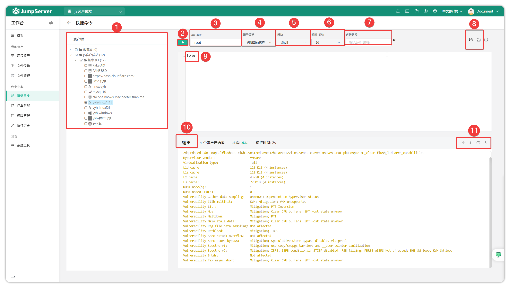

# 快捷命令
!!! warning "在v4.0版本中, 作业中心已默认关闭。需要系统管理员于 `系统设置 > 功能设置 > 作业中心` 中开启。"
!!! tip ""
    - 快捷命令是对用户有权限的资产进行批量命令处理。在资产树中选择需要执行快捷命令的资产，选择账号信息、超时信息等。

!!! tip ""
    - 详细模块说明：

    | 序号 | 名称         | 说明                                                                 |
    |------|--------------|----------------------------------------------------------------------|
    | 1    | 资产树       | 选择执行命令的资产。                                                 |
    | 2    | 运行         | 运行命令的按钮。                                                     |
    | 3    | 运行用户     | 目标资产运行命令的用户。                                             |
    | 4    | 账号策略     | ● 忽略当前资产 ● 优先特权账号 ● 仅特权账号                             |
    | 5    | 语言         | 目前支持的语言类型有：Shell、PowerShell、Raw、Python、MySQL、PostgreSQL、SQL Server。 |
    | 6    | 超时（秒）   | 执行命令超时时效，目前支持：10、30、60，单位为秒。                   |
    | 7    | 运行路径     | 执行该快捷命令的目录。                                               |
    | 8    | 打开命令/保存命令      | 打开模版管理模块中的命令进行使用/保存当前命令到模版管理模块。 |
    | 9    | 命令输入区域 | 需要执行的命令。                                                     |
    | 10   | 结果输出区域 | 执行命令的结果。                                                     |
    | 11   | 清屏与滚动   | 清除所有命令执行的结果。                                             |