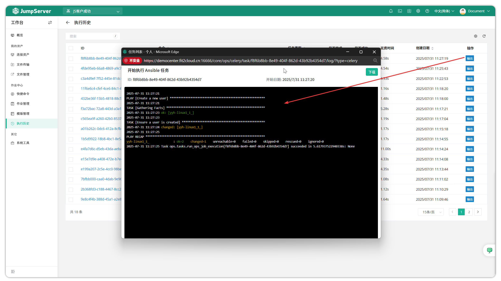

# Execution History

!!! tip ""
    - Enter the **Workbench** page, click **Job Center > Execution History** to open the execution history page.
    - The execution history page mainly records history of tasks in the Job Center module. You can view task execution details and specific output information on this page.

