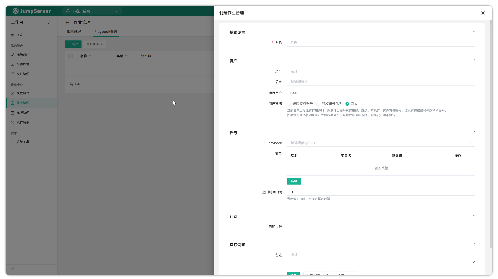
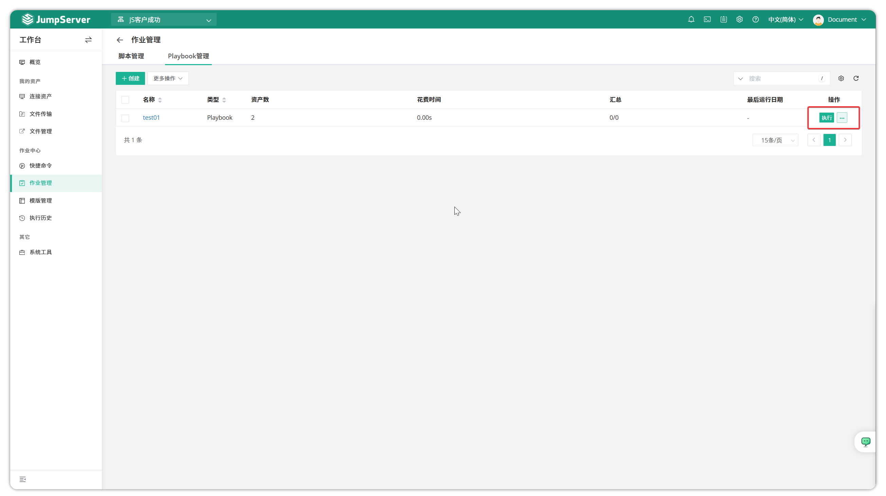

# Jobs Management

!!! tip ""
    - Enter the **Workbench** page, click **Job Center > Jobs Management** to open the jobs management page.
    - Jobs Management supports creating two types of job tasks: commands and Playbooks. Users can set jobs to run periodically or manually, enabling automated operation and maintenance.

## 1 Create Job

!!! tip ""
    - Using Playbook-type job task as an example. Before creating a Playbook job, you need to pre-create a Playbook template in the `Template Management` feature. Click the `Job Center` dropdown menu, select `Jobs Management` to enter the jobs management page, and click the `Create` button to create a Playbook job.

!!! tip ""
    - Enter the Jobs Management - Playbook page, click the `Create` button to create a new Playbook job
    - In the **Playbook Parameters** section, select a pre-created Playbook template; these templates need to be created and configured in `Template Management` beforehand.

## 2 Execute Job

!!! tip ""
    - Click the `Execute` button after a created Playbook job entry to start Playbook job execution.

