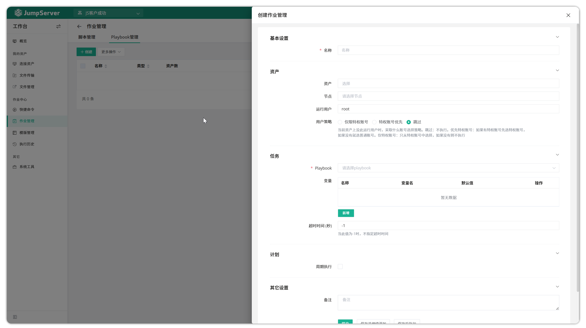
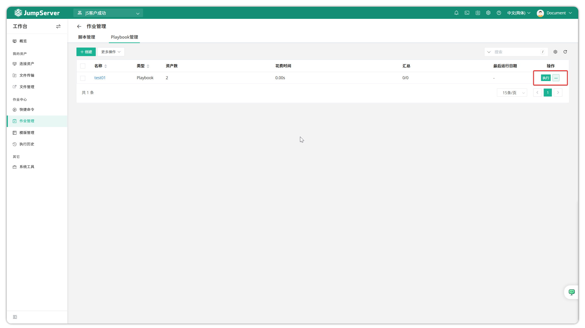

# 作业管理
!!! tip ""
    - 进入 **工作台** 页面，点击 **作业中心 > 作业管理** ，进入作业管理页面。
    - 作业管理功能支持创建命令和 Playbook 两种类型的作业任务，用户可设置定期执行或手动执行作业任务，实现自动化运维操作。

## 1.创建作业
!!! tip ""
    - 以 Playbook 类型作业任务为示例。创建 Playbook 作业前，需要在 `模板管理` 功能中预先创建好 Playbook 模板。点击 `作业中心` 下拉菜单，选择 `作业管理` 进入作业管理页面，点击 `创建` 按钮创建 Playbook 作业。

!!! tip ""
    - 进入作业管理-Playbook 页面，点击 `创建` 按钮创建新的 Playbook 作业
    - 在 **Playbook 参数** 部分选择预先创建的 Playbook 模板，这些模板需要在 `模板管理` 中事先创建和配置。

## 2.执行作业
!!! tip ""
    - 在已创建的 Playbook 作业条目后方点击 `执行` 按钮，即可启动 Playbook 作业执行。
