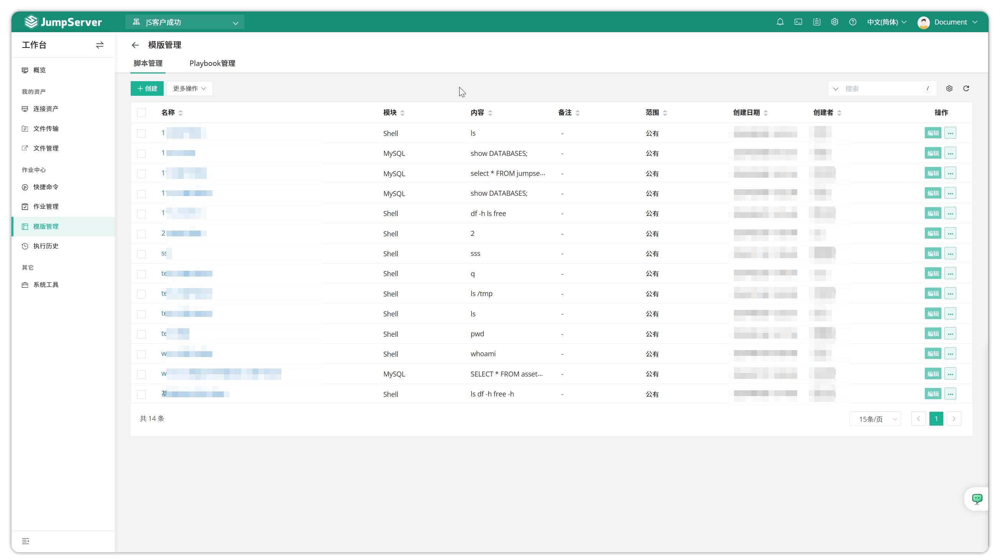
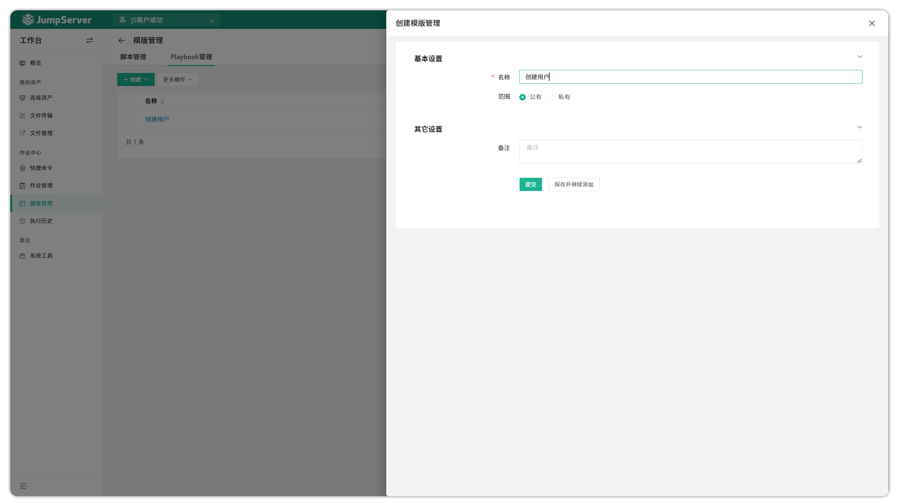
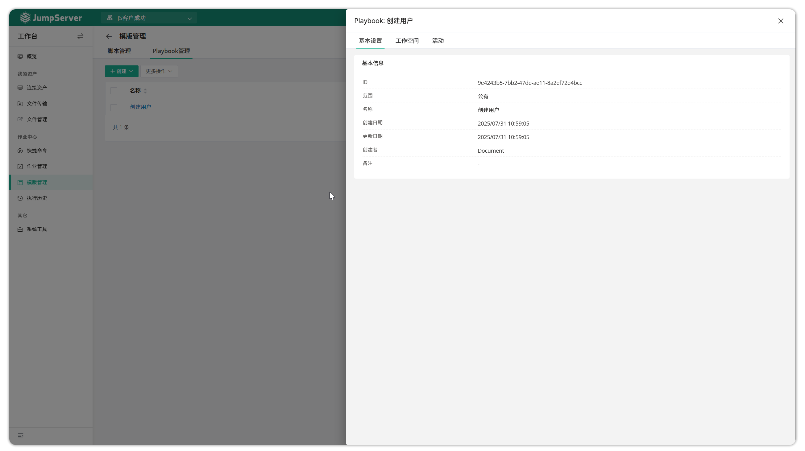
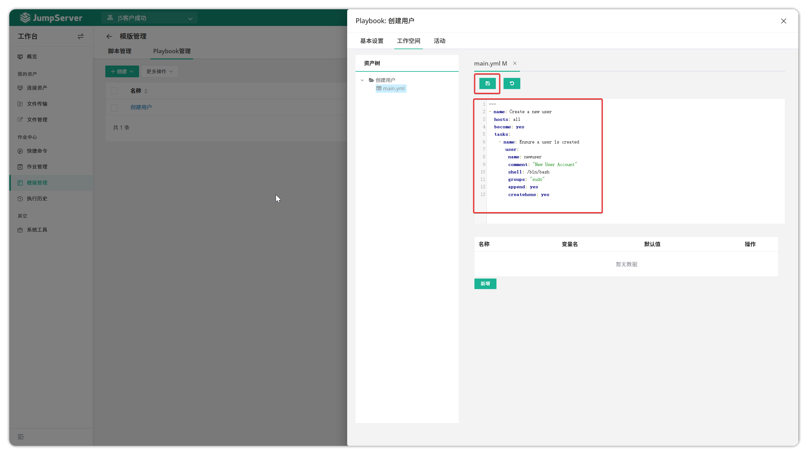
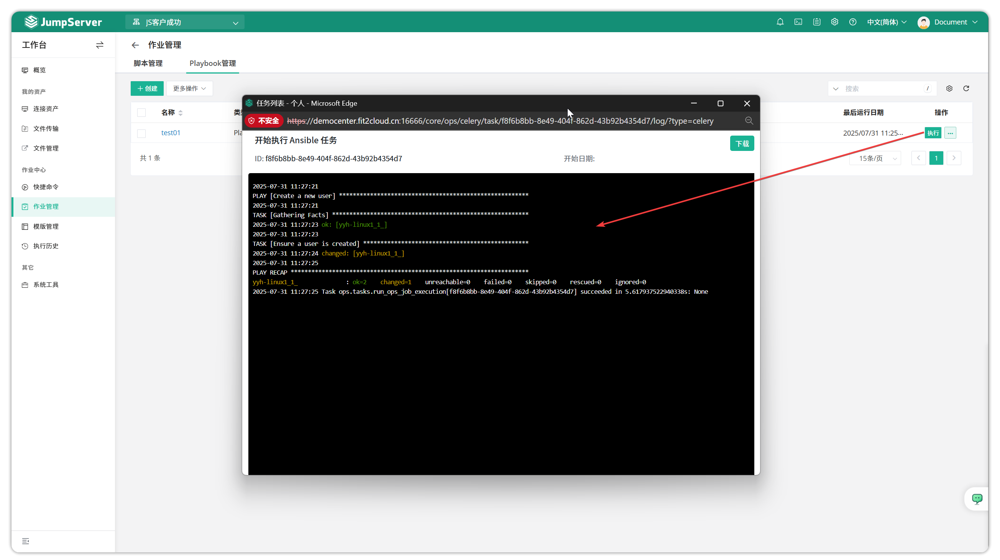

# Templates Management

!!! tip ""
    - Enter the **Workbench** page, click **Job Center > Templates Management** to open the templates management page.
    - Templates Management supports creating two types of templates: commands and Playbooks. Users can quickly create automated tasks in Quick Commands and Jobs Management, improving work efficiency.

## 1 Create Template

!!! tip "Using Playbook-type template as an example, demonstrating the workflow for creating users on target assets."
    - Enter the Job Center page and select Templates Management feature
    - Switch to the `Playbook Management` tab
    - Click the `Create` button to create or upload a Playbook template
    - Set template visibility `Scope` (controls whether other users can see this template); default is `Private`, meaning only the creator can see it
    - Fill in template name and description information

!!! tip ""
    - After completing basic information for the Playbook template, click Confirm to create the template. After successful creation, click the Playbook template name to enter the template detailed configuration page.

!!! tip ""
    - Click the `Workspace` tab to create a main.yml file, as shown below:

!!! tip ""
    - After editing is complete, click the `Save` button at the top of the page to save the main.yml file.

## 2 Template Execution

!!! tip ""
    - On the Jobs Management page, click the `Execute` button to view and monitor task execution progress.

