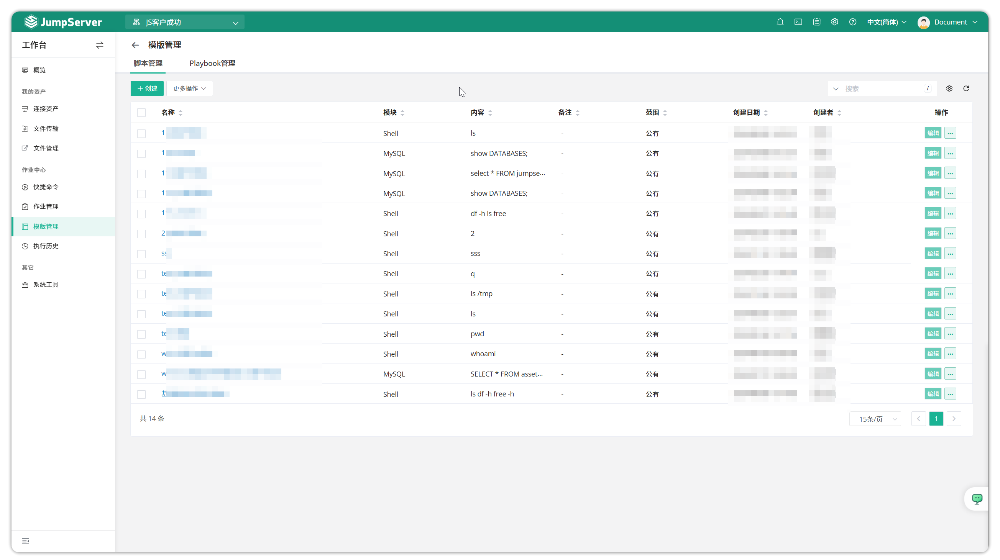
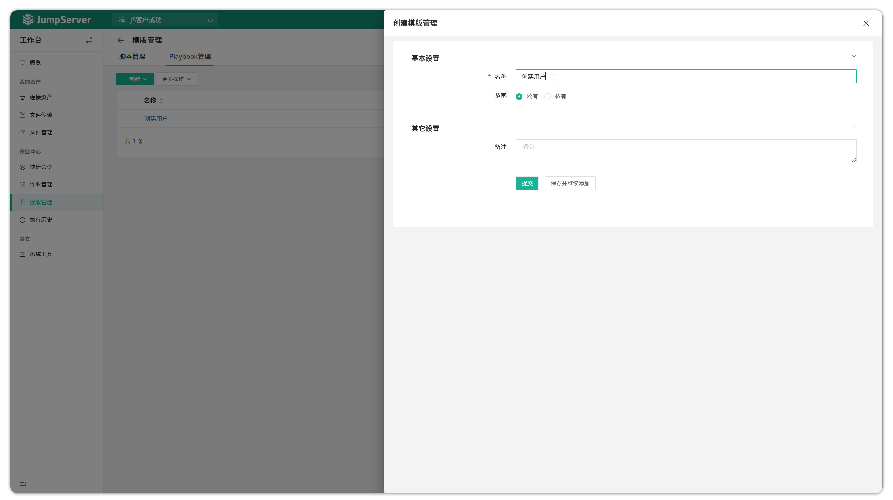
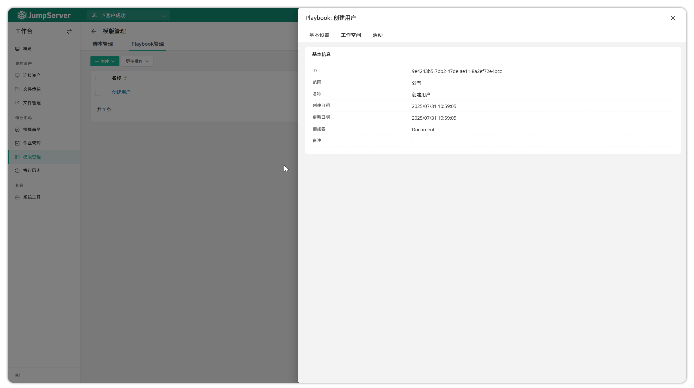
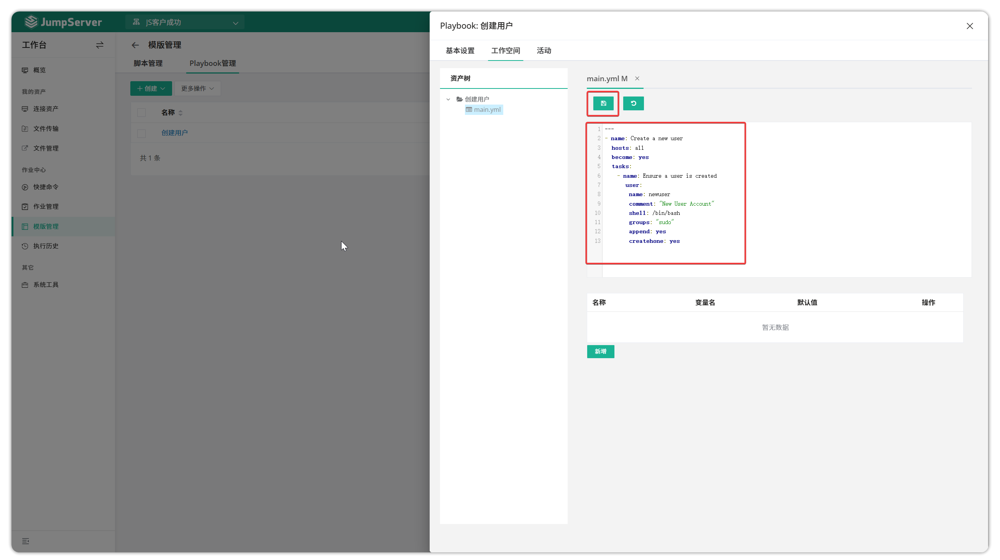
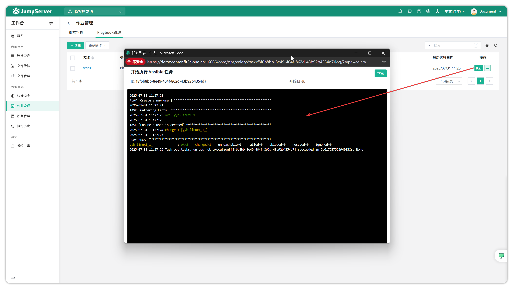

# 模板管理
!!! tip ""
    - 进入 **工作台** 页面，点击 **作业中心 > 模板管理** ，进入模板管理页面。
    - 模板管理功能支持创建命令和 Playbook 两种类型的模板，用户可在快捷命令和作业管理中快速创建自动化任务，提高工作效率。

## 1 创建模板
!!! tip "以 Playbook 类型模板为示例，演示在目标资产中创建用户的操作流程。"
    - 进入作业中心页面，选择模板管理功能
    - 切换至 `Playbook 管理` 选项卡
    - 点击 `创建` 按钮，创建或上传 Playbook 模板
    - 设置模板可见 `范围`（控制其他用户是否可见该模板），默认为 `私有`，即仅创建者可见
    - 填写模板名称和描述信息

!!! tip ""
    - 完成 Playbook 模板的基本信息填写后，点击确认创建模板。创建成功后，点击 Playbook 模板名称，进入模板详细配置页面。

!!! tip ""
    - 点击 `工作空间` 选项卡，创建 main.yml 文件，如下图所示：

!!! tip ""
    - 编辑完成后，点击页面上方的 `保存` 按钮保存 main.yml 文件。

## 2 模板执行
!!! tip ""
    - 在作业管理页面点击 `执行` 按钮，可以查看和监控任务执行过程。

