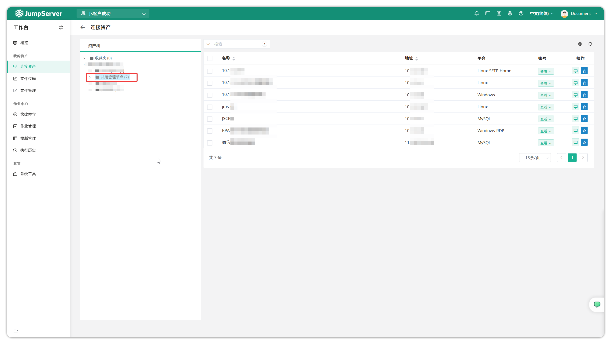
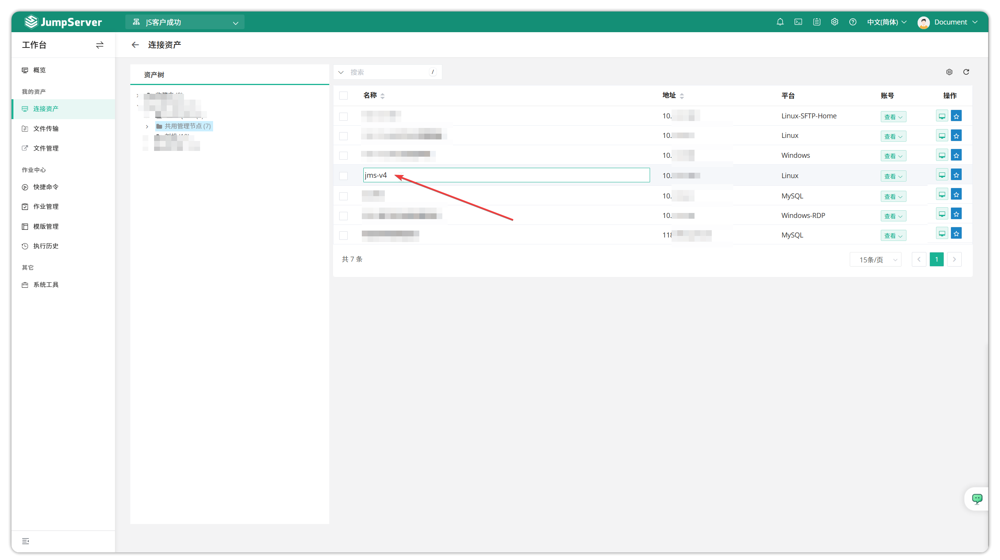
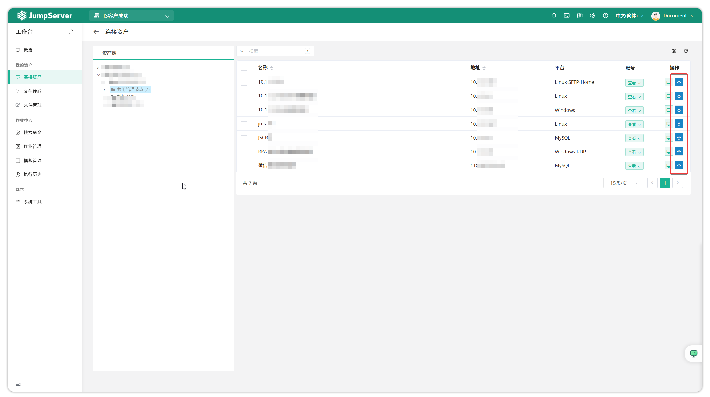

# Connected Assets

!!! tip ""
    - Enter the **Workbench** page, click **My Assets > Connected Assets** to open the connected assets page.
    - The connected assets page mainly contains asset information that administrators have authorized to the current user. The left side of the page shows the asset tree of assets authorized to the current user, and the right side shows all assets authorized to the current user.

!!! tip ""
    - Click on an asset name to customize asset names within your permissions.

!!! tip ""
    - Click the first button after an asset to quickly jump to the Web Terminal page and connect to the corresponding asset.

!!! tip ""
    - Click the `Favorite` button to add the current asset to favorites, making it more convenient to quickly search and connect to the asset in Web Terminal.

