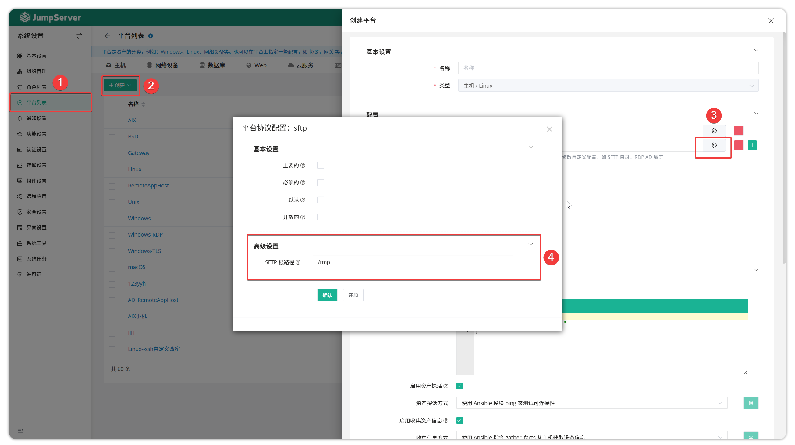
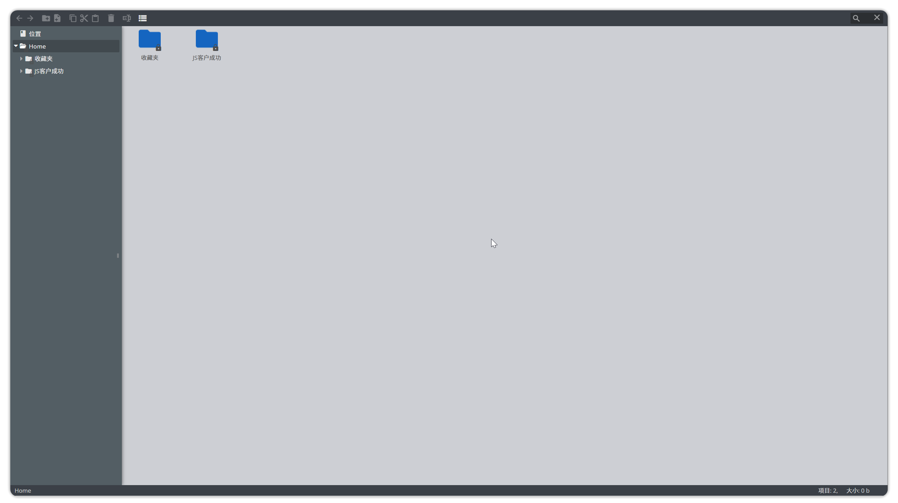
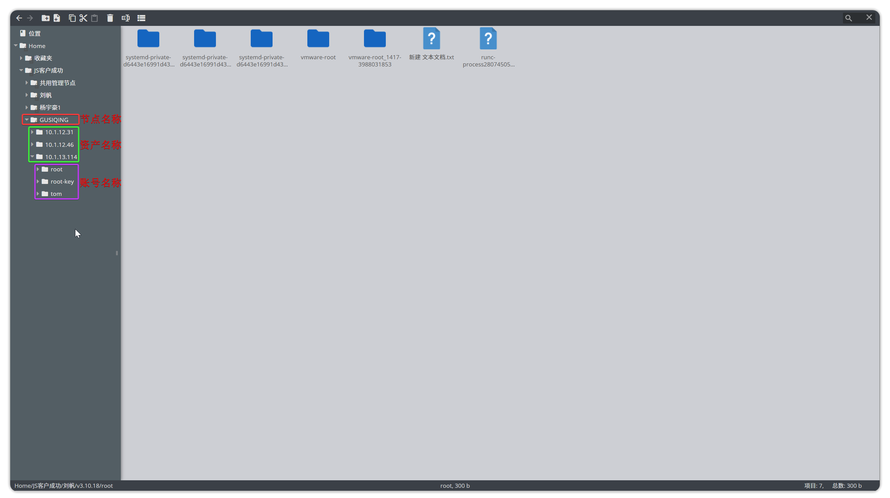
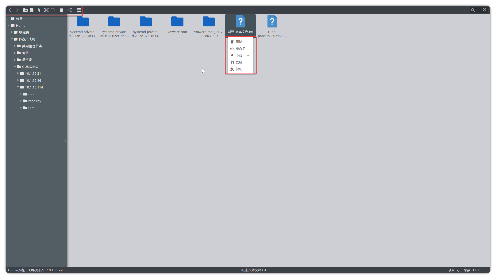
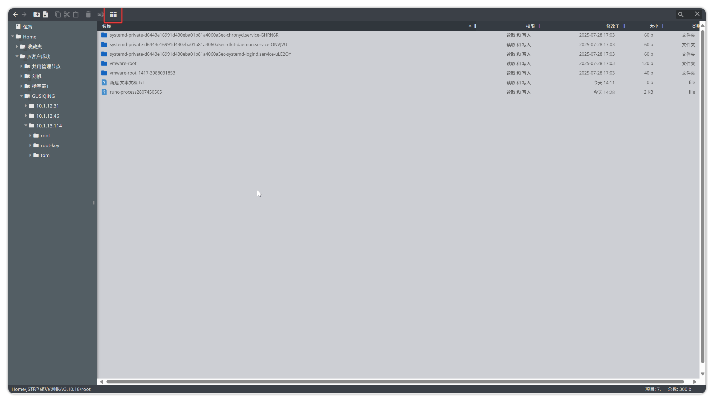

# File Explorer

!!! tip ""
    - Click the **Workbench** button on the navigation bar to open the **Workbench** page.
    - Click **My Assets > File Explorer** to open the **File Explorer** page.
    - By default, SFTP directory for upload and download is set to `/tmp`. SFTP directory is bound to asset platforms. The default SFTP directory in JumpServer cannot be modified; if modification is needed, create a new system platform in **Settings > Platform List** and adjust accordingly.
    - Click the **Settings** icon to modify the default SFTP path.

!!! tip ""
    - The file explorer page is shown below; right-click on the upper black area to select text labels to display their meanings:

!!! tip ""
    - Click the corresponding information in the left node tree to enter the SFTP directory in the asset. When an asset has only one account authorized, clicking on the asset name directly enters the SFTP directory of the authorized user for that asset.
    - When an asset has multiple accounts authorized, click on the asset name and then select the corresponding account to enter the corresponding SFTP directory.

!!! tip "After entering the SFTP directory, you can perform operations on folders or files. Two operation methods are supported:"
    - **Method 1:** Right-click directly on the right side of the page to bring up the operation menu.
    - **Method 2:** Use buttons in the upper section to perform corresponding operations.

!!! tip ""
    - JumpServer supports adjusting the view for displaying files. The adjustment button and adjusted view are shown below:

