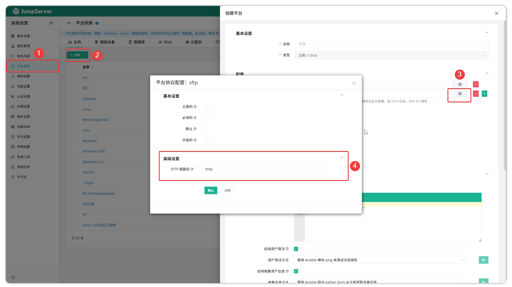
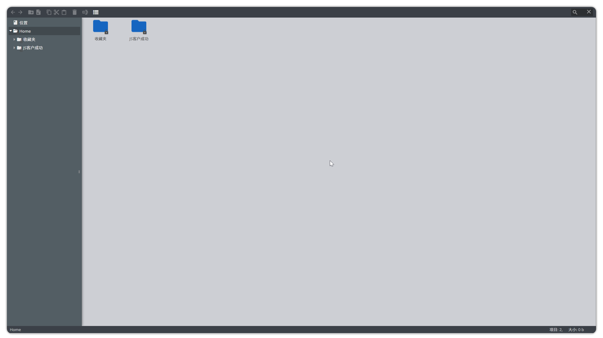
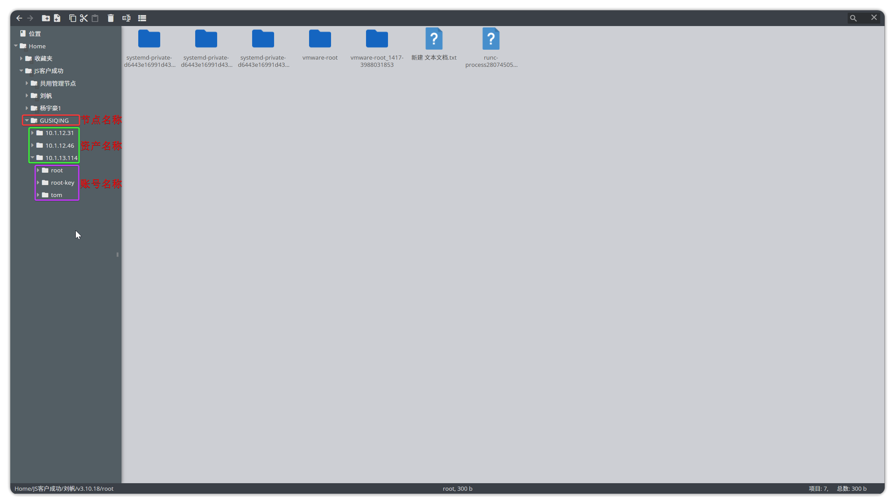
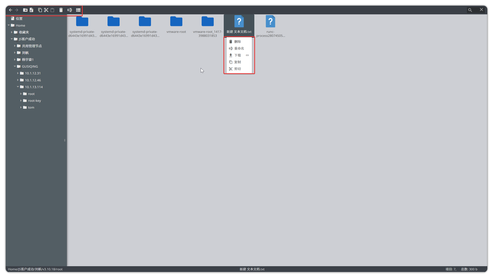
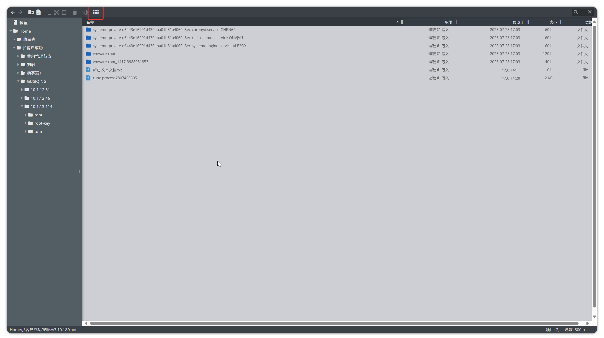

# 文件管理
!!! tip ""
    - 默认情况下，上传和下载的SFTP目录设置为 `/tmp`。SFTP目录绑定到资产平台。JumpServer 中的默认 SFTP 目录无法修改；如果需要修改，则需要在 `设置`-`平台列表` 创建新的系统平台并相应地进行调整。
    - 点击 `小齿轮` 修改SFTP的默认路径。

!!! tip ""
    - 文件管理页面如下图所示，右击上方黑色区域选择文本标签可显示标签含义：

!!! tip ""
    - 点击左侧节点树对应信息，即可进入资产中的SFTP目录。当某个资产有且仅有一个账号授权时，点击资产名称即可直接进入该资产对应授权用户的SFTP目录。
    - 当某个资产拥有多个账号授权时，需点击资产名称后选择资产对应的账号才能进入对应的SFTP目录。

!!! tip "进入SFTP目录后，即可对文件夹或文件对应操作。操作方式支持两种："
    - 第一种方式：直接在右侧页面右击唤出操作菜单
    - 第二种方式：上方黑色部分的按钮进行对应的操作

!!! tip ""
    - JumpServer支持调整展示文件的视图。调整按钮与调整之后的视图如下所示：
