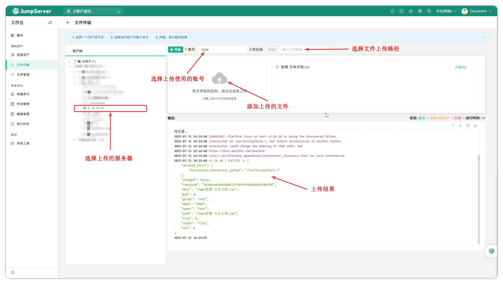

# File Transfer

## 1 Batch Transfer

!!! warning "Currently only supports file transfer for Linux assets. For security reasons, the default transfer directory is `/tmp` and cannot be modified. For specifying a directory, use the **File Explorer** feature."

!!! tip ""
    - Click the **Workbench** button on the navigation bar to open the **Workbench** page.
    - Click **My Assets > File Transfer** to open the **File Transfer** page.
    - JumpServer supports batch file transfer functionality, allowing you to upload local files to multiple managed Linux assets.

