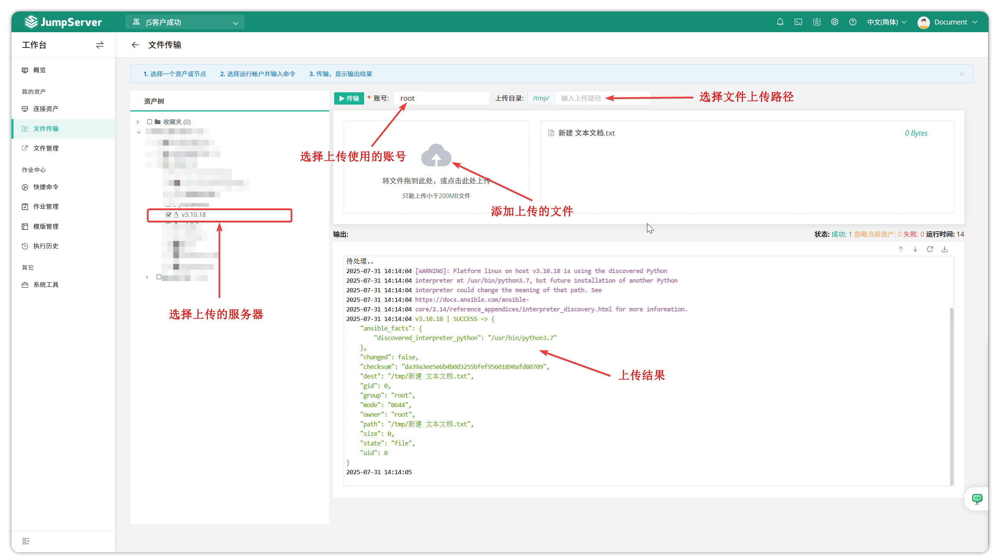

# 文件传输

## 1. 批量传输
!!! warning "目前仅支持 Linux 资产的文件传输功能。出于安全考虑，默认传输目录为 `/tmp`，且无法修改。如需指定目录，请用 **文件管理** 功能进行操作。"
!!! tip ""
    - 进入 **工作台** 页面，点击 **我的资产 > 文件传输** ，进入文件传输页面。
    - JumpServer 支持批量文件传输功能，可将本地文件批量上传至多个受管 Linux 资产中。
