# Web Terminal

!!! tip ""
    - The Web Terminal page is primarily used for asset connections. Click the <Web Terminal> button on the Workbench page or the icon in the top-right corner to jump to the Web Terminal page and initiate asset access from this page.
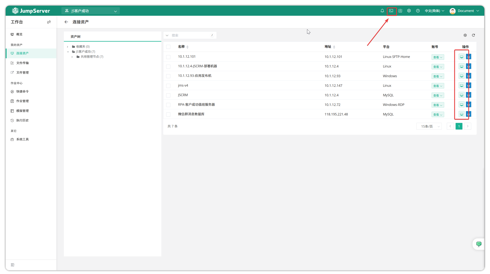

## 1 Organization Switch

!!! tip ""
    - JumpServer supports displaying authorized assets for users by organization on the Web Terminal page. When a user has asset authorization across multiple organizations, you can switch organizations using the buttons shown in the figure and obtain authorized assets from that organization; when needing to connect to assets, you can select desired assets from the left asset tree, or search by asset name or IP for quick target finding, then click to login.
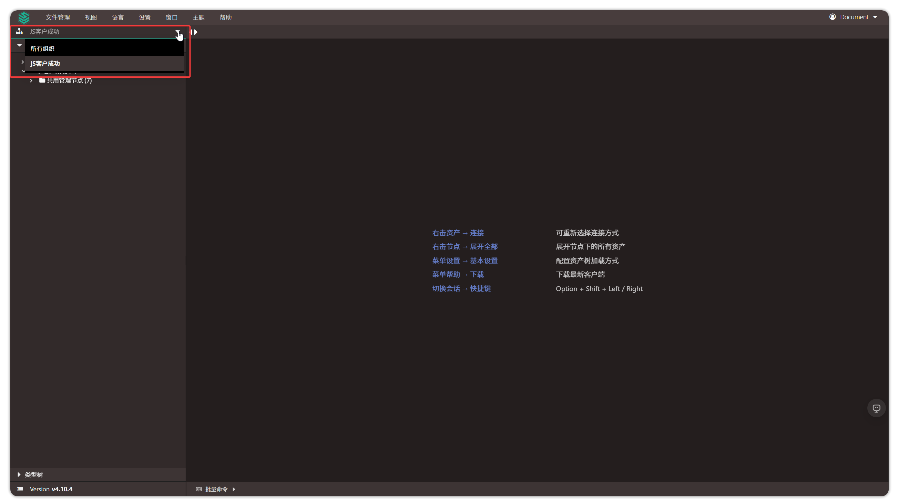

## 2 Batch Asset Connection

!!! tip ""
    - The Web Terminal page supports users to batch connect to assets. Use the batch selection options in the top-left corner to select assets to connect, then perform batch connection operations on these assets.
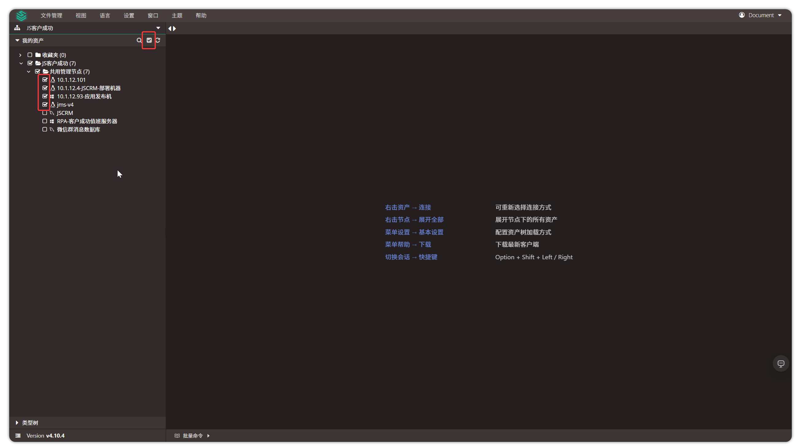

## 3 Session Dragging

!!! tip ""
    - When users connect to assets using **Web Terminal** mode, the corresponding Tab windows can be manually dragged to adjust arrangement positions.
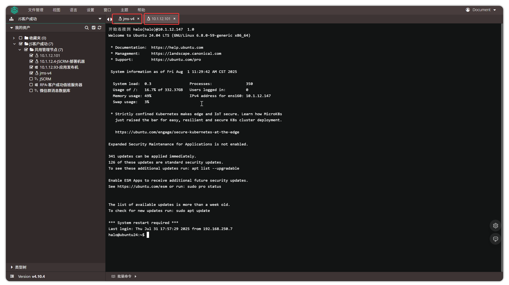

## 4 Session Switching

!!! tip ""
    - When users connect to multiple assets, they can use **ALT+Left/Right** keyboard shortcut to quickly jump to the next session.

## 5 Session Split Screen

!!! tip ""
    - When users connect to assets, they can open multiple sessions in one browser interface and view real-time execution results of batch commands, making it convenient to compare session content. (Currently supports up to 4 split screens per session).
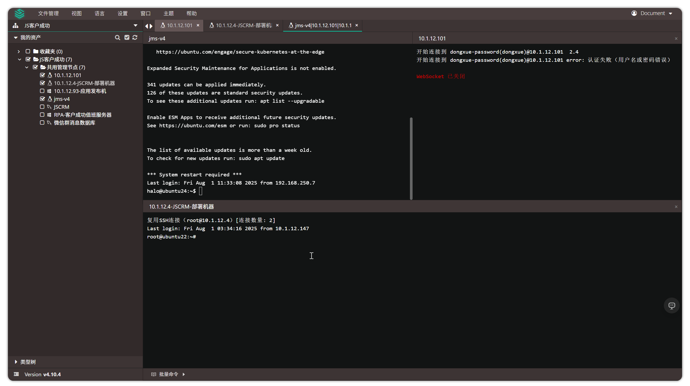

## 6 Asset Connection

!!! tip ""
    - The main function of the Web Terminal page is asset connection. Different asset types support different connection methods.

### 6.1 Linux Asset Connection

!!! tip "Web CLI"
    - Web CLI is command-line connection mode. Connection result is shown below:
    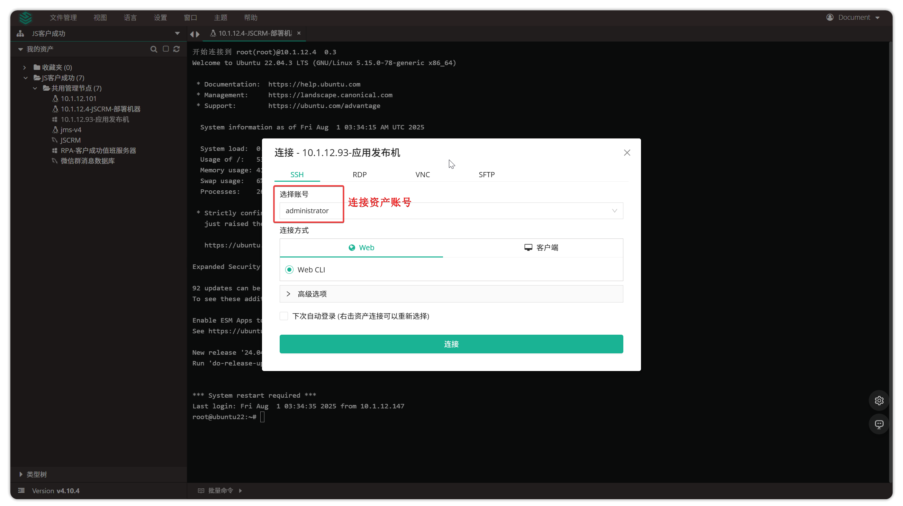

!!! tip "Web SFTP"
    - Web SFTP connection result is shown below:
    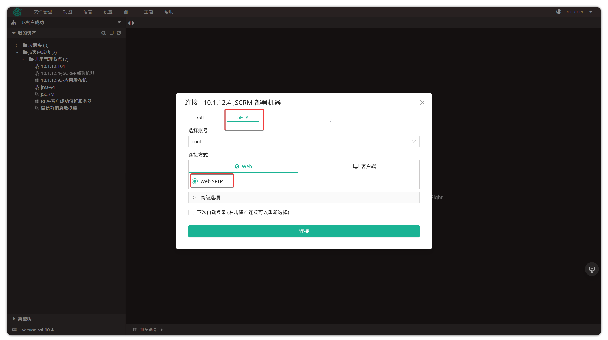

!!! tip "SSH Client"
    - JumpServer supports connecting to Linux assets by launching **SSH Client**. Users select **Client - SSH Client** mode to connect, which will launch JumpServer client, and JumpServer client will launch **local SecureCRT client or other clients and auto-fill connection data**, enabling connection.
    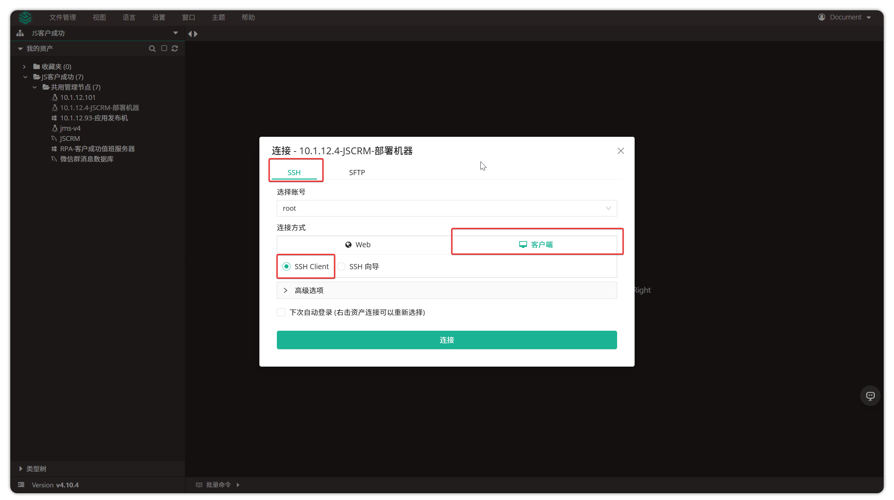

!!! tip "SSH Wizard"
    - JumpServer supports connecting to Linux assets by **generating encrypted information**. Users select **Client - SSH Wizard** mode to connect, which will generate encrypted connection information. Users can copy the encrypted information here and execute it in any command line to connect to the corresponding asset.
    

### 6.2 Windows Asset Connection

!!! tip ""
    - Windows assets display the number of currently connected users in the connection button for that asset.
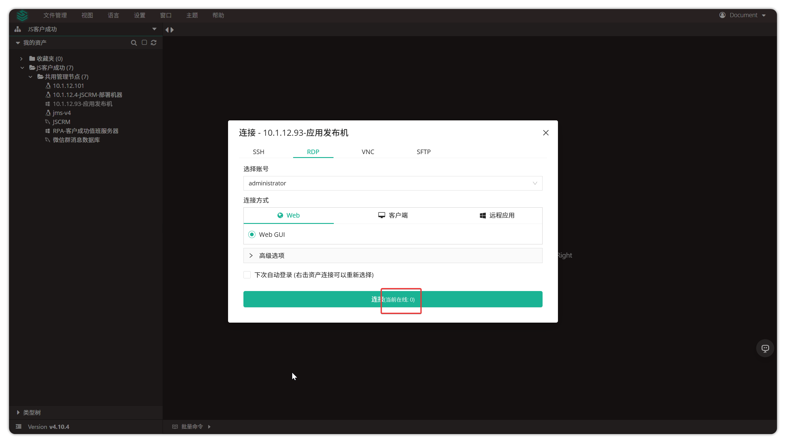

!!! tip ""
    - JumpServer supports three connection modes for Windows assets: **Web GUI**, **Remote Desktop Client**, and **RDP File**.

!!! tip "Web GUI"
    - Web GUI mode connects to Windows directly on the JumpServer page, as shown below:
    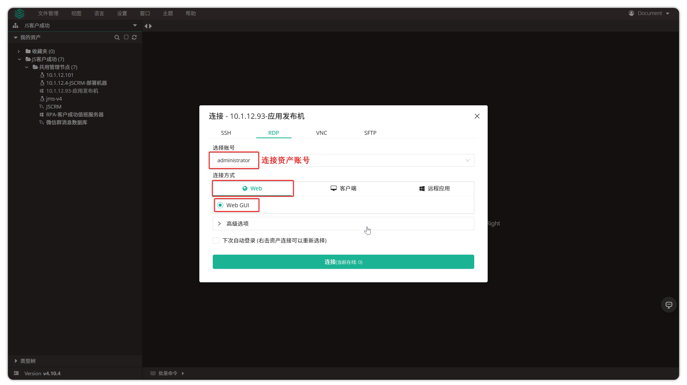

!!! tip "Remote Desktop"
    - **Remote Desktop** mode will launch JumpServer client, which launches Windows local Mstsc program to connect to Windows asset. Mac system users need to download official Microsoft RDP client (accessible through the **Download** button in the **Help** module of **Web Terminal**).
    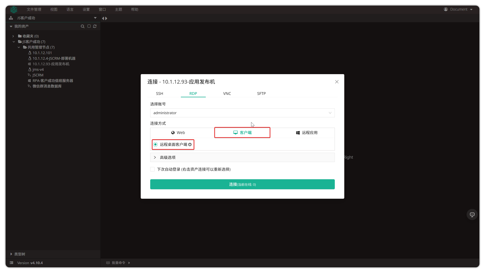

!!! tip "RDP File"
    - **RDP File** mode downloads an RDP file. Clicking the RDP file launches Windows local Mstsc program to connect to Windows asset. Mac system users need to download official Microsoft RDP client (accessible through the **Download** button in the **Help** module of **Web Terminal**).
    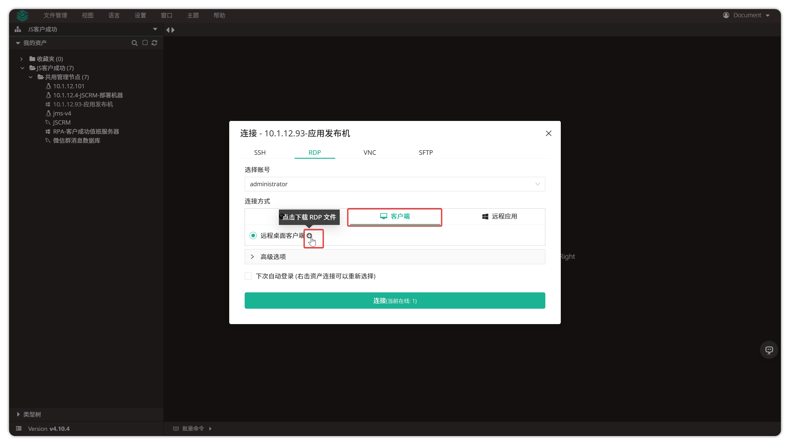
    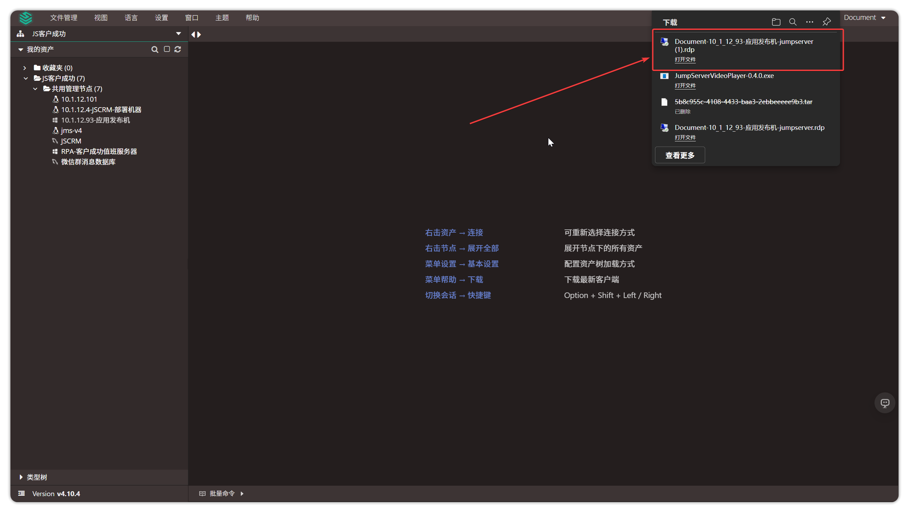

### 6.3 Database Asset Connection

!!! tip ""
    - JumpServer provides multiple ways to login to databases. For example, command-line Web CLI, graphical Web GUI, database proxy direct connection DB Client, and remote application mode launching DBeaver.

!!! tip ""
    Database connection methods support:

| Database Type | Web GUI | Web CLI | Database Client (X-Pack) | DB Connection Wizard (X-Pack) | Remote Application Mode |
| --- | --- | --- | --- | --- | --- |
| MySQL | ✓ | ✓ | ✓ | ✓ | ✓ |
| MariaDB | ✓ | ✓ | ✓ | ✓ | ✓ |
| PostgreSQL | ✓ | ✓ | ✓ | ✓ | ✓ |
| Oracle (X-Pack) | ✓ | ✓ | ✓ | ✓ | ✓ |
| SQLServer (X-Pack) | ✓ | ✓ | ✓ | ✓ | ✓ |
| Redis | ✗ | ✓ | ✓ | ✓ | ✓ |
| MongoDB | ✗ | ✓ | ✓ | ✓ | ✓ |
| ClickHouse (X-Pack) | ✗ | ✓ | ✗ | ✗ | ✓ |
| Dameng (X-Pack) | ✓ | ✗ | ✗ | ✗ | ✓ |

!!! info "Description"
    - ✓: Supports this connection mode
    - ✗: Does not support this connection mode

!!! tip "Web CLI Mode"
    - On the Web Terminal page, click a database and select **Web CLI** mode to connect to the database. Connection result is shown below:
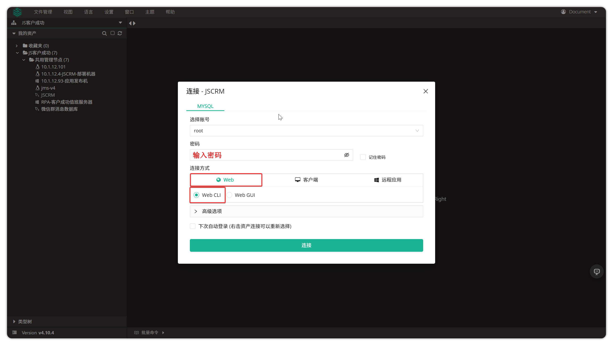

!!! tip "Web GUI Mode"
    - On the Web Terminal page, click a database and select **Web GUI** mode for graphical database connection.

!!! tip "Client Mode"
    - **Database Client:** This feature requires pre-configuration of JumpServer client. On the Web Terminal page, click a database, select **Client** mode, **Database Client** to connect to database. This will launch DBeaver client on your personal PC (if pre-configured). Download JumpServer client by clicking the **Download** button in the **Help** module of **Web Terminal**.
    - **DB Connection Wizard:** On the Web Terminal page, click a database, select **Client** mode, **DB Connection Wizard** to generate database connection information (information generated by **Client** mode provides two connection methods to database).

!!! tip "Remote Application Mode"
    - On the Web Terminal page, click a database and select **Remote Application** mode to connect to database. Prerequisite for using this mode is that administrators have pre-set remote applications and published remote applications like Navicat or DBeaver. For detailed explanation of remote applications, refer to the [Remote Applications](../../system_settings/remote_apps.md) section.

## 7 File Explorer

!!! tip ""
    - On the Web Terminal page, click the **File Explorer** button and select the **Connect** button to enter the file explorer module. For detailed explanation of file explorer, refer to the [File Explorer](file_explorer.md) section.

## 8 View

!!! tip ""
    - The **View** button is used to display the asset connection interface in full screen (only available when connecting to assets).
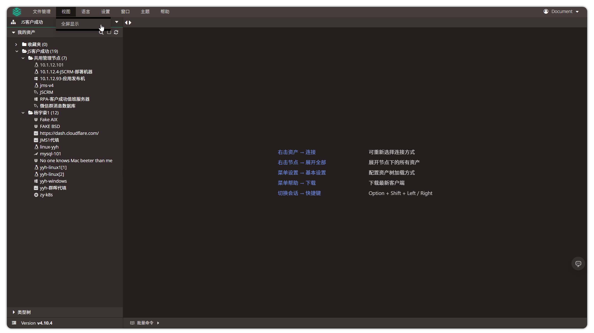

## 9 Language

!!! tip ""
    - JumpServer supports multiple languages including English, Chinese, Japanese, Portuguese, Spanish, and Russian. Use the **Language** button to switch the display language of JumpServer system.
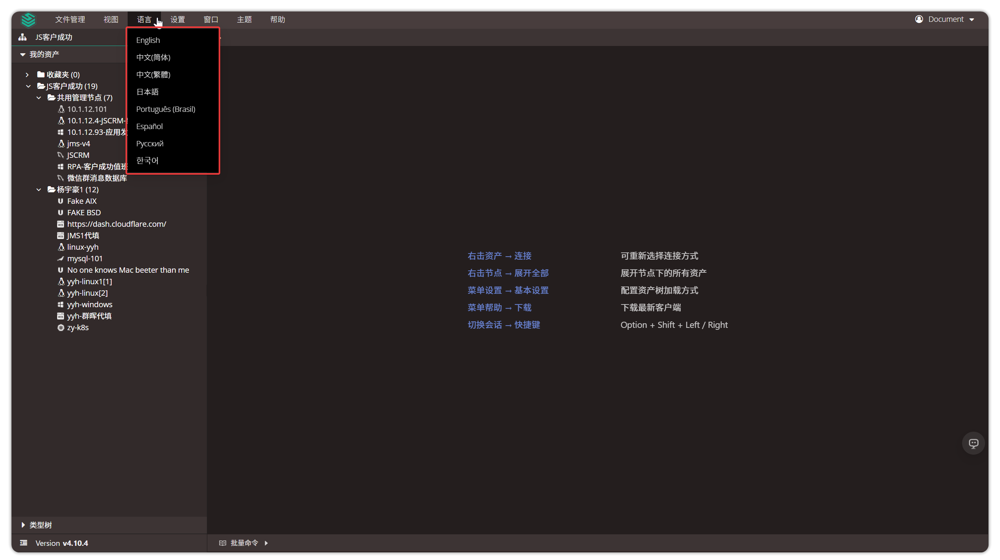

## 10 Settings

!!! tip ""
    - The **Settings** button is used to configure related settings during JumpServer asset connection process, including basic configuration, graphical interface, and command-line modules.

!!! tip "Basic Configuration"
    - **Async Load Asset Tree**: Set whether to load asset tree in real-time during asset connection.

!!! tip "Graphical Configuration"
    - **RDP Resolution**: Set RDP connection resolution; default is Auto.
    - **RDP Smart Size**: When enabled, automatically calculates optimal zoom ratio between local and remote windows.
    - **Keyboard Layout**: Select keyboard layout to use when connecting to Windows assets.
    - **RDP Client Options**: Configure whether to enable full screen mode and disk mounting when RDP client connects.
    - **Remote Application Connection Mode**: Select connection mode for remote applications (Web or **Client** mode).

!!! tip "Command-line Configuration"
    - **Character Terminal Font Size**: Set display size of terminal font.
    - **Character Terminal Backspace As Ctrl+H**: Set whether to enable Ctrl+H as delete key shortcut.
    - **Right-click Quick Paste**: Set whether to enable right-click quick paste functionality in command-line.
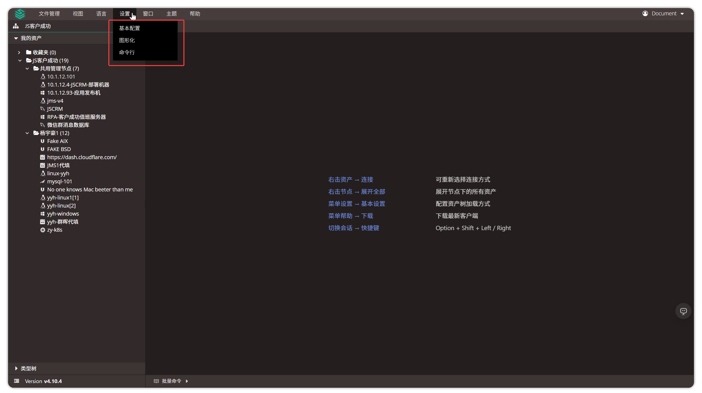
