# Web终端
!!! tip ""
    - Web 终端页面主要用于资产连接。点击工作台页面的<Web 终端>按钮或者右上角图标，均可跳转到 Web 终端页面，并在此页面发起资产访问。
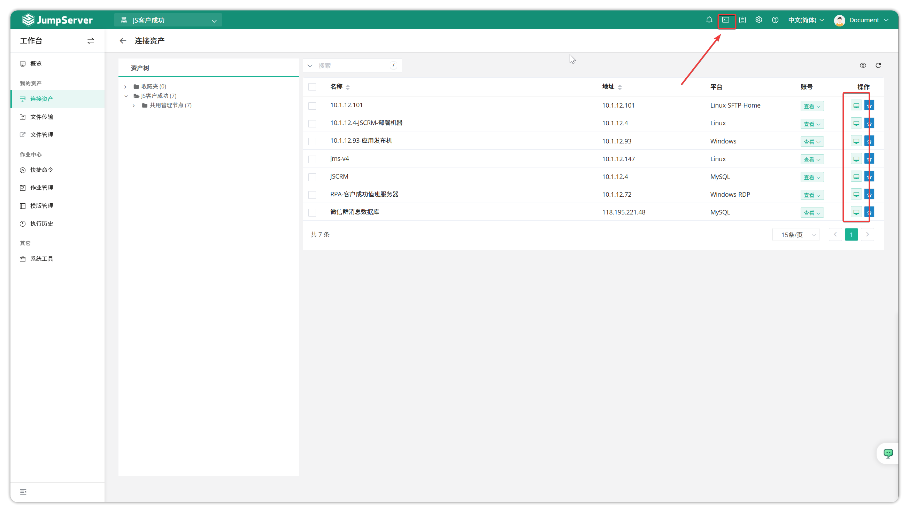

## 1 组织切换
!!! tip ""
    - JumpServer 支持在 Web 终端页面按照组织显示授权给用户的资产。当某一个用户在多组织下都拥有资产授权时，可在如图示中按钮切换组织并获取该组织的授权资产；在需求连接资产时，可以在左侧资产树列表中选择需要访问的资产，也可以通过资产名称或 IP 进行模糊搜索，快速找到访问目标，点击即可登录。
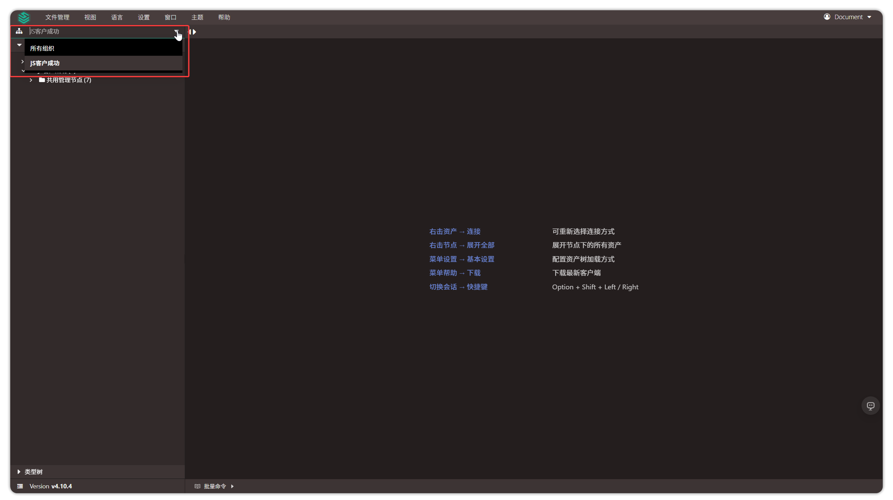

## 2 批量资产连接
!!! tip ""
    - Web 终端页面支持用户批量连接资产。通过页面左上角的批量选项选择需要连接的资产，对资产批量发起连接操作。
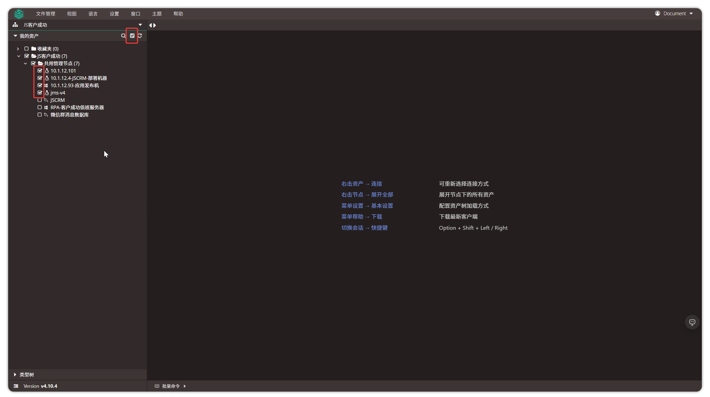

## 3 会话拖拽
!!! tip ""
    - 用户使用 **Web Terminal** 方式连接资产时，支持对相应的 Tab 窗口手动拖拽，调整排列位置。
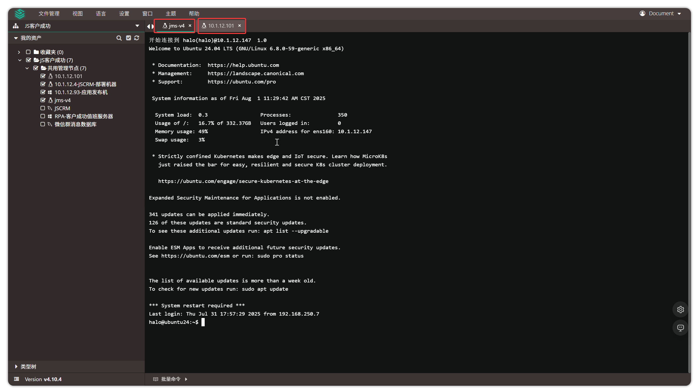

## 4 会话切换
!!! tip ""
    - 用户连接多个资产时，可以使用 **ALT+Left/Right** 组合快捷键快速跳转至下一个会话。

## 5 会话分屏
!!! tip ""
    - 用户连接资产时，可以在一个浏览器界面打开多个会话，并对批量命令的执行结果进行实时查看，方便用户对会话中的内容进行对比操作。（目前单个会话最多支持 4 个分屏）。
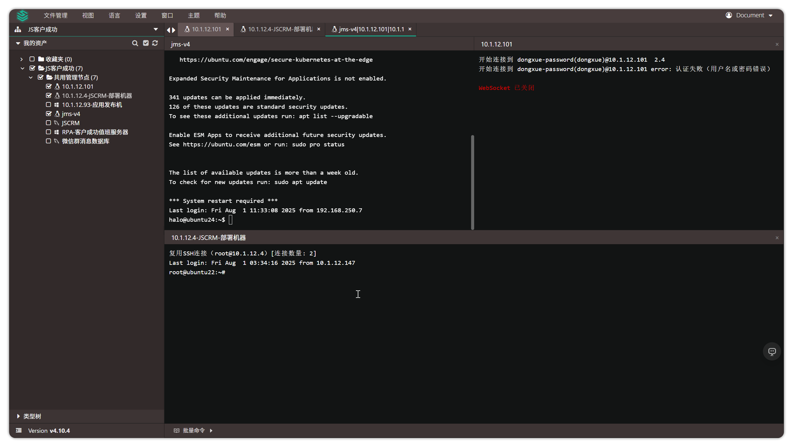

## 6 资产连接
!!! tip ""
    - Web 终端页面主要功能为资产连接，不同类型的资产支持的连接方式也不同。
### 6.1 Linux资产连接
!!! tip "Web CLI"
    - Web CLI 即命令行连接方式，连接结果如下图所示：
    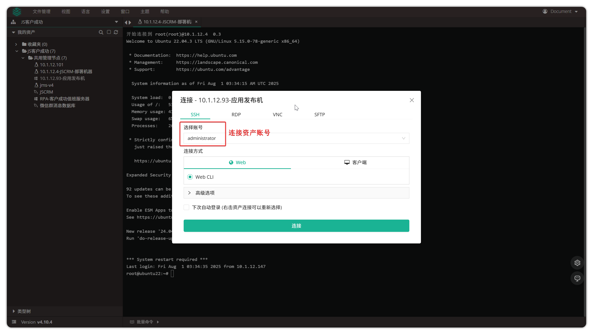

!!! tip "Web SFTP"
    - Web SFTP连接结果如下图所示：
    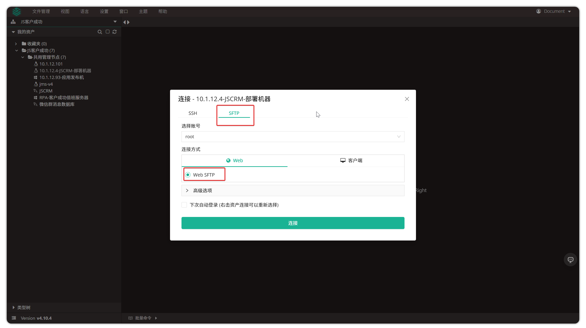

!!! tip "SSH 客户端"
    - JumpServer 支持通过拉起 **SSH 客户端** 的方式连接 Linux 资产。用户选择 **客户端-SSH 客户端** 方式连接，即可拉起JumpServer客户端，JumpServer客户端拉起 **本地的SecureCRT客户端或其他客户端并代填连接数据** ，即可连接。
    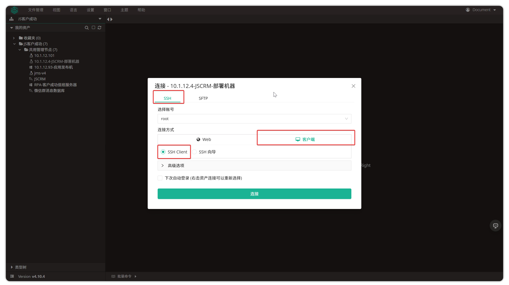

!!! tip "SSH 向导"
    - JumpServer 支持通过 **生成加密信息的方式** 连接 Linux 资产。用户选择 **客户端-SSH 向导** 方式连接，即可生成加密的连接信息。用户可复制此处的加密信息到任意命令行执行连接对应的资产。
    

### 6.2 Windows资产连接
!!! tip ""
    - Windows 资产在连接按钮中显示该资产当前已连接的用户数量。
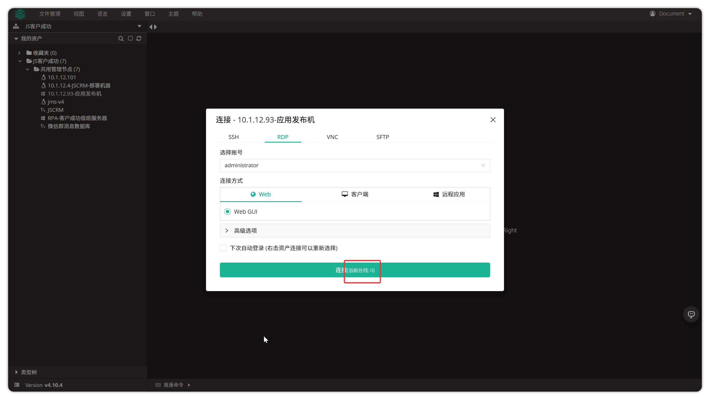

!!! tip ""
    - Windows 资产 JumpServer 支持三种连接方式，分别为 **Web GUI** 、 **远程桌面客户端** 、 **RDP文件** 。
!!! tip "Web GUI"
    - Web GUI 方式即在 JumpServer 页面对 Windows 进行连接，如下图所示：
    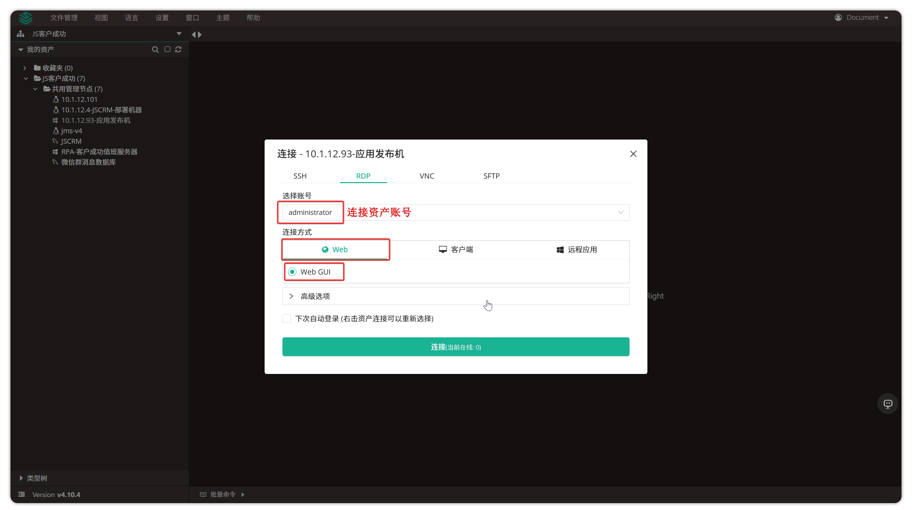

!!! tip "远程桌面"
    -  **远程桌面** 方式会拉起 JumpServer 客户端，JumpServer 客户端拉起 Windows本地的 Mstsc 程序连接 Windows 资产，Mac 系统需下载微软 RDP 官方客户端（点击  **Web终端** 中的  **帮助**  模块中的  **下载**  按钮跳转后的页面中）。
    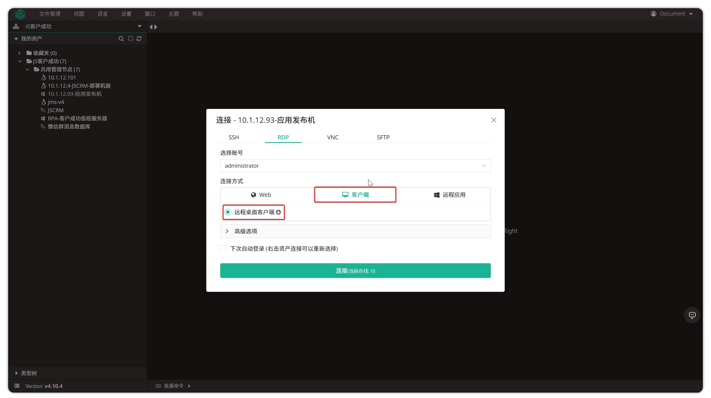

!!! tip "RDP文件"
    -  **RDP文件** 方式会下载一个 RDP 文件，点击 RDP 文件后拉起 Windows 本地的 Mstsc 程序连接 Windows 资产，Mac 系统需下载微软 RDP 官方客户端（点击  **Web 终端**  中的  **帮助**  模块中的  **下载**  按钮跳转后的页面中）。
    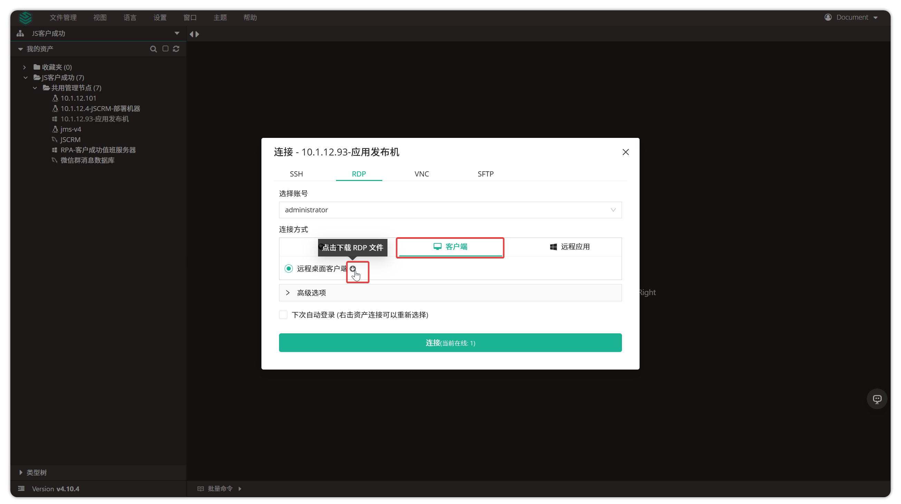
    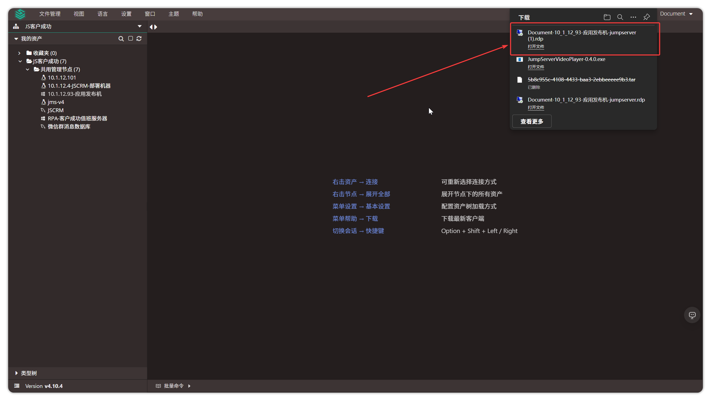

### 6.3 数据库资产连接
!!! tip ""
    - JumpServer 提供多种方式登录数据库。例如命令行的方式 Web CLI，图形化方式 Web GUI，数据库代理直连数据库方式 DB Client，远程应用方式拉起 DBeaver。

!!! tip ""
    数据库连接方式支持情况：

| 数据库类型 | Web GUI | Web CLI | 数据库客户端(X-Pack) | DB 连接向导(X-Pack) | 远程应用方式 |
|-----------|---------|---------|-------------|------------|-------------|
| MySQL | ✓ | ✓ | ✓ | ✓ | ✓ |
| MariaDB | ✓ | ✓ | ✓ | ✓ | ✓ |
| PostgreSQL | ✓ | ✓ | ✓ | ✓ | ✓ |
| Oracle(X-Pack) | ✗ | ✓ | ✓ | ✓ | ✓ |
| SQLServer(X-Pack) | ✗ | ✓ | ✓ | ✓ | ✓ |
| Redis | ✓ | ✗ | ✓ | ✓ | ✓ |
| MongoDB | ✓ | ✗ | ✓ | ✓ | ✓ |
| ClickHouse(X-Pack) | ✓ | ✗ | ✗ | ✗ | ✓ |
| Dameng(X-Pack) | ✓ | ✗ | ✗ | ✗ | ✓ |

!!! info "说明"
    - ✓：支持该连接方式
    - ✗：不支持该连接方式

!!! tip "Web CLI 方式"
    - 在 Web 终端页面点击数据库，选择 **Web CLI** 方式连接数据库。连接结果如下图所示：
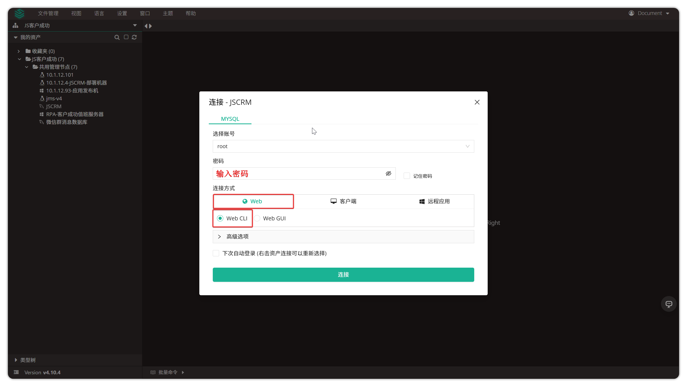

!!! tip "Web GUI 方式"
    - 在 Web 终端页面点击数据库，选择 **Web GUI** 方式图形化连接数据库。

!!! tip "客户端方式"
    -  **数据库客户端:** 此功能需要提前配置 JumpServer 客户端。在 Web 终端页面点击数据库,选择 **客户端**  方式  **数据库客户端**  连接数据库,该操作会拉起个人 PC 机中的客户端 DBeaver(已经配置的前提下)进行连接。下载 JumpServer 客户端可点击  **Web终端**  中的  **帮助**  模块中的  **下载**  按钮跳转后的页面中。
    -  **DB 连接向导:** 在 Web 终端页面点击数据库,选择 **客户端**  方式  **DB 连接 向导**  生成连接数据库连接信息( **客户端** 方式生成的信息提供两种连接方式连接数据库)。

!!! tip "远程应用方式"
    - 在 Web 终端页面点击数据库，选择 **远程应用**  方式连接数据库。使用此方式的前提，需要管理员提前设置了远程应用并发布了远程应用 Navicat 或者 DBeaver。远程应用模块具体解释可参考 [远程应用](../../system_settings/remote_apps.md) 部分。

## 7 文件管理
!!! tip ""
    - 在 Web 终端页面，点击 **文件管理** 按钮，选择 **连接** 按钮即可进入文件管理模块。文件管理模块具体解释可参考 [文件管理](file_explorer.md) 部分。

## 8. 视图
!!! tip ""
    -  **视图**  按钮用于全屏显示资产连接界面（仅在连接资产时可用）。
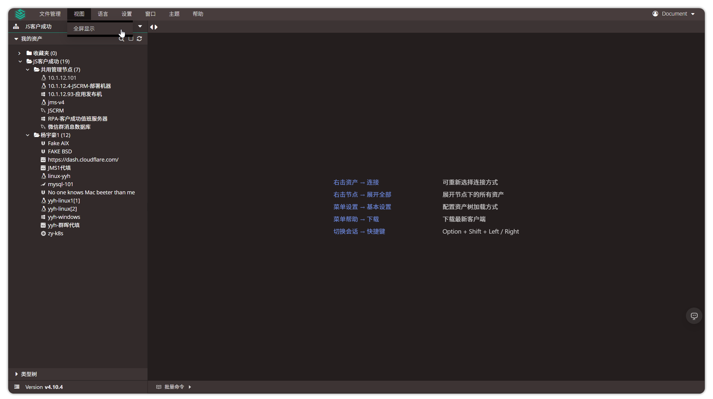

## 9. 语言
!!! tip ""
    - JumpServer 支持多种语言，包括英语、中文、日语、葡萄牙语、西班牙语、俄语。通过  **语言**  按钮可以切换 JumpServer 系统的显示语言。
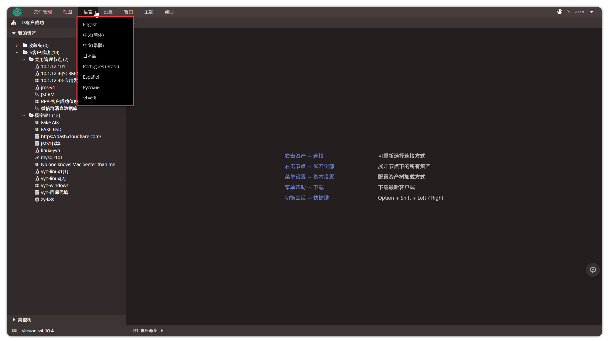

## 10. 设置
!!! tip ""
    -  **设置**  按钮用于配置 JumpServer 资产连接过程中的相关设置，包含基本配置、图形化、命令行三个模块。

!!! tip "基本配置"
    - **异步加载资产树**：设置资产连接过程中是否实时加载资产树。

!!! tip "图形化配置"
    - **RDP 分辨率**：设置 RDP 连接分辨率，默认为 Auto。
    - **RDP 智能大小**：启用后可自动计算本地窗口与远程窗口的最佳缩放比例。
    - **键盘布局**：选择连接 Windows 资产时使用的键盘布局。
    - **RDP 客户端选项**：配置 RDP 客户端连接时是否启用全屏模式和磁盘挂载功能。
    - **远程应用连接方式**:选择远程应用的连接方式(Web 或 **客户端** 方式)。

!!! tip "命令行配置"
    - **字符终端字体大小**：设置终端字体的显示大小。
    - **字符终端 Backspace As Ctrl+H**：设置是否启用快捷键 Ctrl+H 作为删除键。
    - **右键快速粘贴**：设置是否启用命令行右键快速粘贴功能。
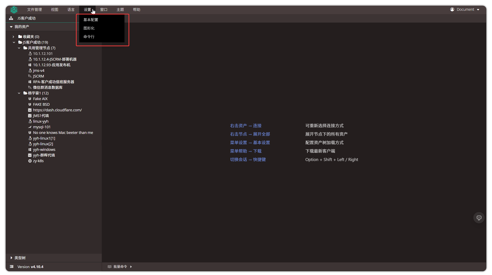

## 11 帮助
!!! tip ""
    -  **帮助**  按钮主要分为三个模块，文档、支持、下载三个模块。
    - 文档与支持跳转链接可进行修改，修改按钮位于： **系统设置 → 其它设置 → 导航栏链接模块** 。
    - 下载链接跳转至 JumpServer系统周边工具下载，包含：JumpServer 客户端、微软 RDP 客户端、JumpServer 离线录像播放器等。
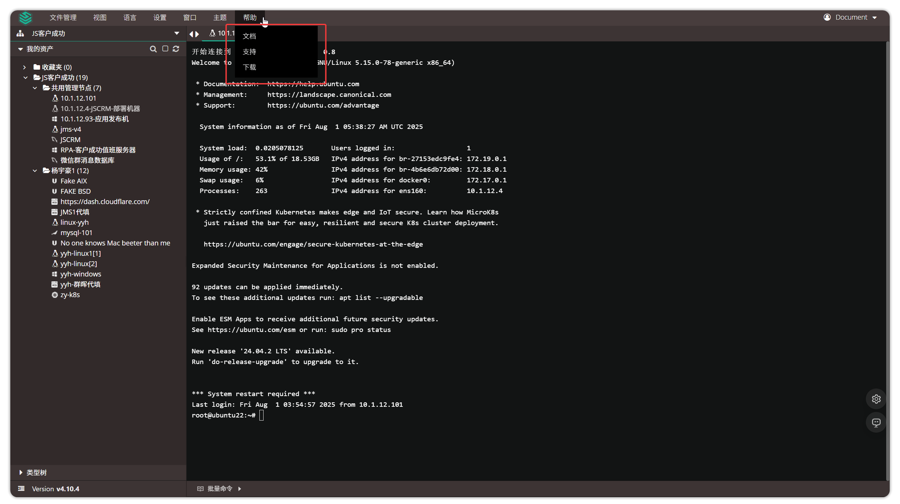

## 12 窗口列表
!!! tip ""
    -  **窗口列表**  按钮可查看正在连接的所有会话并进行切换。
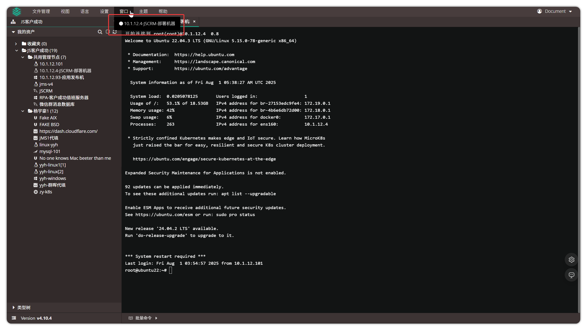