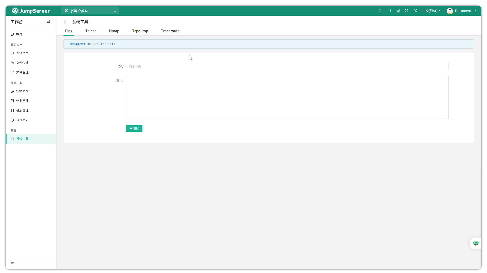

# System Tools

!!! warning "Requires system administrator to enable at `System Settings > Feature Settings > System Tools`."

!!! tip ""
    - Enter the **Workbench** page, click **Other > System Tools** to open the system tools page.
    - Click the **System Tools** tab on the left side of the page to access the system tools page. This page includes system tools such as Ping, Telnet, Nmap, Tcpdump, and Traceroute to check network connections between assets and JumpServer service.

