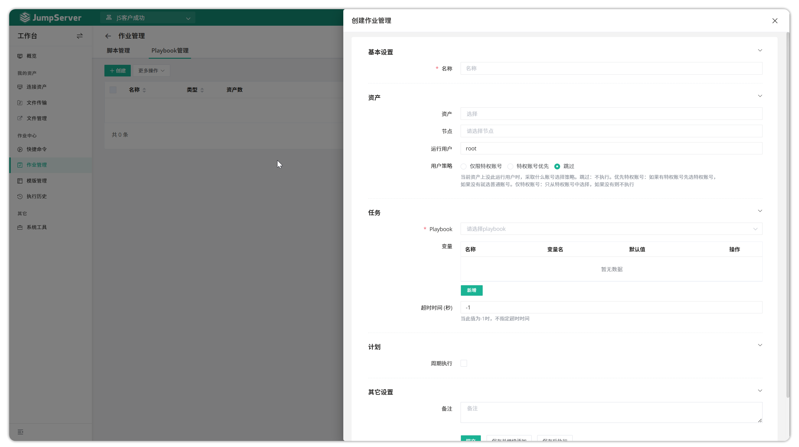

# 作业管理
!!! tip ""
    - 作业管理功能主要针对命令、Playbook 两种作业类型创建作业任务，并设置定期执行作业任务或手动执行作业任务。
## 1 创建作业
!!! tip ""
    以 Playbook 类型作业任务为示例。作业任务中的 Playbook 参数需要在`模版管理`功能中提前创建好 Playbook 模版后进行选择。点击`作业中心`下拉框选择`作业管理`按钮进入作业管理页面，点击`创建`按钮，创建一个 Playbook 作业。

!!! tip ""
    - 进入作业管理-Playbook 页面。单击<创建>按钮创建 Playbook 作业。
    - **Playbook 参数** 部分的可用选项中选择 Playbook 模板，这些选项需要在`模板管理`中创建和管理。

## 2 执行作业
!!! tip ""
     Playbook 示例作业后方`执行`按钮，即执行 Playbook 作业。
