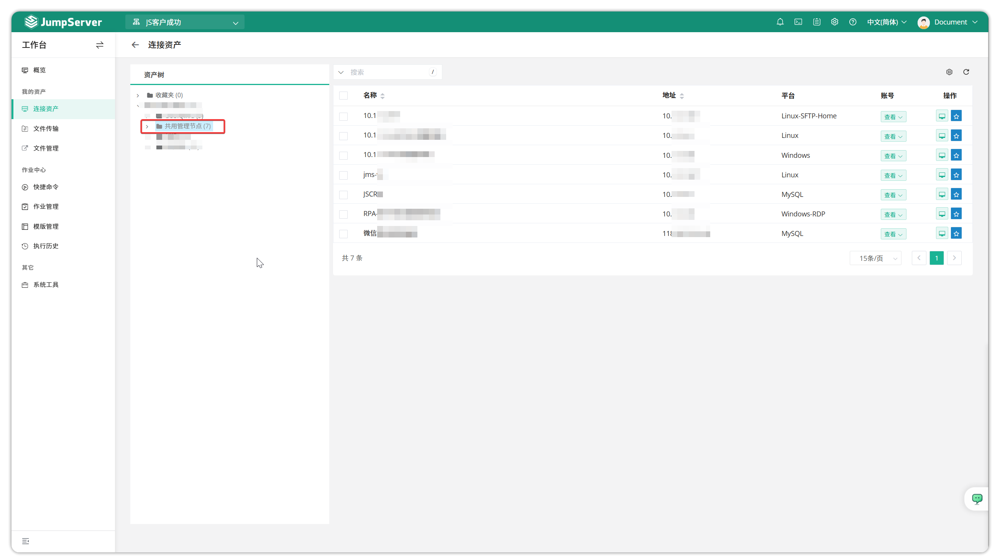
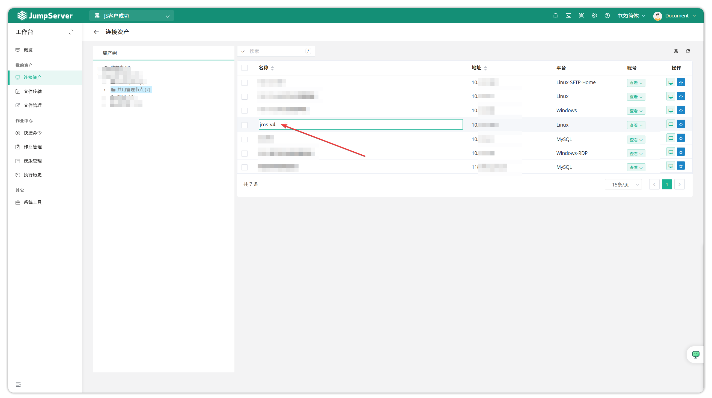
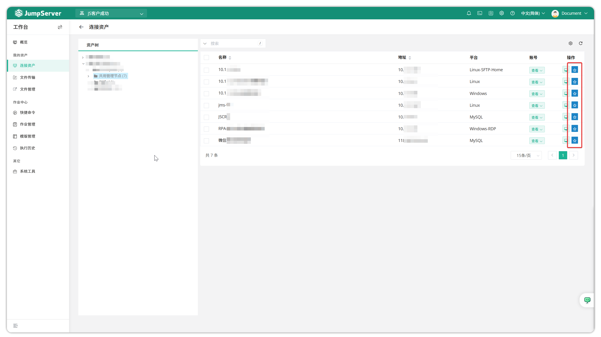

# 连接资产
!!! tip ""
    - 连接资产页面主要包含的是管理员已经授权给当前用户的资产信息。页面左侧为管理员用户授权给当前用户的资产所处的点树，页面右侧为管理员用户授权给当前用户的所有资产。

!!! tip ""
    - 点击资产名称可以进入修改资产在该账号的命名。

!!! tip ""
    - 点击资产后方的第一个按钮，可以快速跳转到 Web 终端页面并连接对应资产。

!!! tip ""
    - 单击`收藏`按钮，可将当前资产添加到收藏夹中，从而在 Web 终端中更方便地快速查找和连接到该资产。
