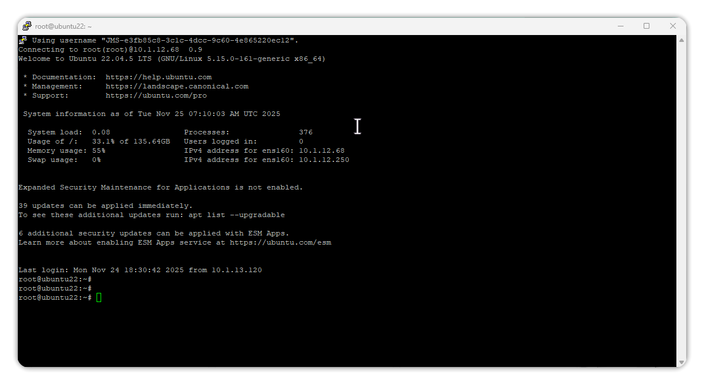
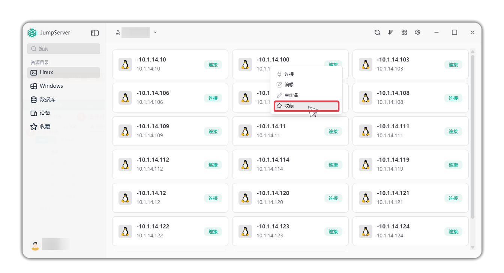

# Asset Connection

!!! info "Note: RDP client connection and database client connection are JumpServer enterprise features."

## Linux Asset Connection

!!! tip ""
    - The client supports SSH, SFTP, and VNC protocols to connect to target Linux assets. After connection, you can execute commands and upload/download files.

!!! tip ""
    - In the Linux asset list, click **Connect** next to the target asset name to open the connection window.
    - In the connection window, select the protocol, choose the account to use, and click the **Confirm** button to connect to the asset.

## Windows Asset Connection

!!! tip ""
    - The client supports RDP, VNC, SSH, and SFTP protocols to connect to target Windows assets. After connection, you can execute commands and upload/download files.

!!! tip ""
    - In the Windows asset list, click **Connect** next to the target asset name to open the connection window.
    - In the connection window, select the protocol, choose the account to use, and click the **Confirm** button to connect to the asset.

## Database Asset Connection

### Local Client Configuration

!!! tip ""
    - Before using the client method to connect to databases, you need to configure the local client invocation path.
    - Click the settings button in the top-right corner to enter the settings page.
    - Click **Database** to expand the list of supported databases; here MySQL is used as an example.
    - After selecting **MySQL**, a list of available applications appears on the right with download options. Click **Download Application** and install it.
    - After installation, click **Select path** to configure its installation path, then you can use the application to connect to databases.

### Connect to Asset

!!! tip ""
    - In the **Database** asset list, click **Connect** next to the target asset name to automatically invoke the client to connect to the asset.

## Device Asset Connection

!!! tip ""
    - The client supports SSH protocol to connect to target device assets. Device assets include **General**, **Cisco**, **Huawei**, and **H3C** by default.

!!! tip ""
    - In the **Devices** asset list, click **Connect** next to the target asset name to open the connection window.
    - In the connection window, select the protocol, choose the account to use, and click the **Confirm** button to connect to the asset.

## Favorite Asset Connection

!!! tip ""
    - On the connection page for various asset types, you can right-click on the target asset and click **Favorite** to add the target asset to the favorites list.

