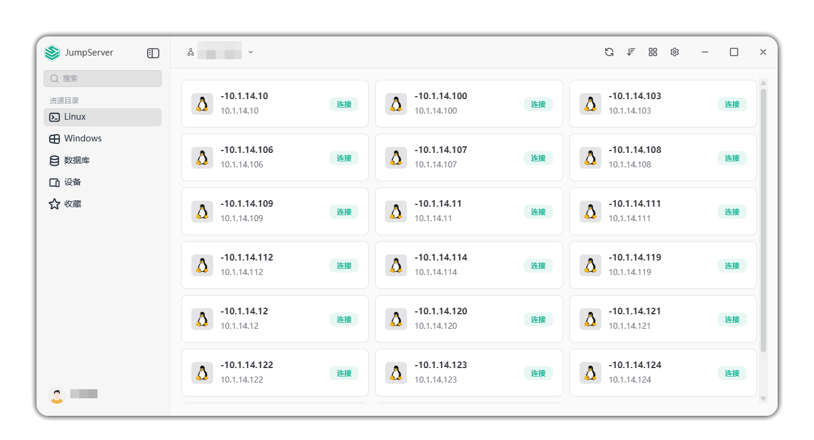

# Client Download and Installation

## Introduction

!!! tip ""
    JumpServer Client is a cross-platform desktop application that supports Windows, macOS, and Linux systems. Users can use the client to locally connect and manage remote assets (Windows, Linux, databases, and network devices) managed by JumpServer.

!!! warning "Note: The new client (>=v4.0.0) only supports JumpServer versions **v4.10.13 and above**. Please ensure your server version meets the requirements."
    

## Client Download

Installation packages for various platforms

| Operating System | Architecture | Download Link |
| --- | --- | --- |
| Windows | x64 | [JumpServerClient_{{ jumpserver.client_tag }}_x64-setup.exe](https://github.com/jumpserver/client/releases/download/v{{ jumpserver.client_tag }}/JumpServerClient_{{ jumpserver.client_tag }}_x64-setup.exe) |
| macOS | Apple Silicon (M1/M2) | [JumpServerClient_{{ jumpserver.client_tag }}_aarch64.dmg](https://github.com/jumpserver/client/releases/download/v{{ jumpserver.client_tag }}/JumpServerClient_{{ jumpserver.client_tag }}_aarch64.dmg) |
| macOS | Intel (x64) | [JumpServerClient_{{ jumpserver.client_tag }}_x64.dmg](https://github.com/jumpserver/client/releases/download/v{{ jumpserver.client_tag }}/JumpServerClient_{{ jumpserver.client_tag }}_x64.dmg) |
| Linux | amd64 (Ubuntu/Debian) | [JumpServerClient_{{ jumpserver.client_tag }}_amd64.deb](https://github.com/jumpserver/client/releases/download/v{{ jumpserver.client_tag }}/JumpServerClient_{{ jumpserver.client_tag }}_amd64.deb) |

> Users can visit '<JumpServer Server Address>/core/download/' page to download the client installation package for the corresponding platform. Enterprise server supports downloading in intranet environments.

## Client Interface Preview

