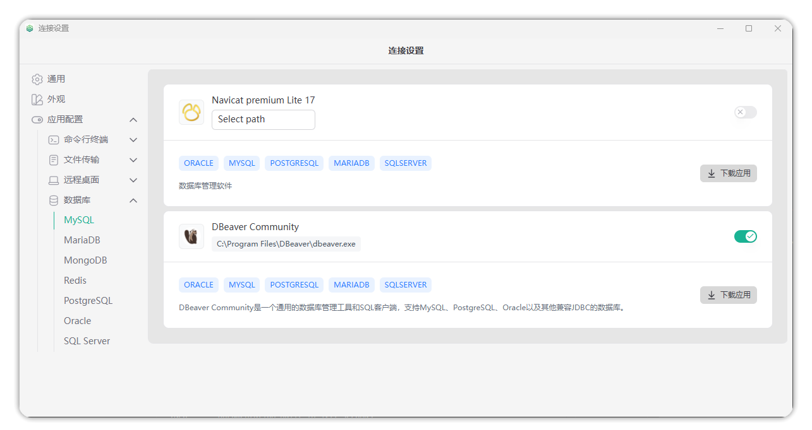

# 客户端下载与安装
## 简介

!!! tip ""
    本次 v4.10.13 LTS 版本推出的全新客户端，采用 Rust 生态的 Tauri 框架 重构，替代了此前的 Electron 框架，带来两大核心突破：

    - 极致轻量化：安装包体积从 Electron 版本的约 150MB 缩减至仅 13MB，降低一个数量级，分发与安装效率显著提升；

    - 体验原生化：优化界面布局与交互逻辑，完美适配 macOS 与 Windows 系统 UI 风格，操作流畅度及系统融合感大幅增强。

## 下载
### Windows
- [Windows](https://github.com/jumpserver/client/releases/download/v4.0.0/JumpServerClient_4.0.0_x64-setup.exe)

### MAC
- [MAC](https://github.com/jumpserver/client/releases/download/v4.0.0/JumpServerClient_4.0.0_aarch64.dmg)

### Linux (如 Ubuntu)
- [Linux](https://github.com/jumpserver/client/releases/download/v4.0.0/JumpServerClient_4.0.0_amd64.deb)

其他系统请自行进入JumpServer 官方 GitHub 仓库下载对应版本
仓库访问地址
- [https://github.com/jumpserver/client/releases](https://github.com/jumpserver/client/releases)

!!! warning "注意"
    新版客户端仅支持 Jumpserver 版本 v4.10.13 及以上版本，请确保 Jumpserver 版本在 v4.10.13 及以上。

