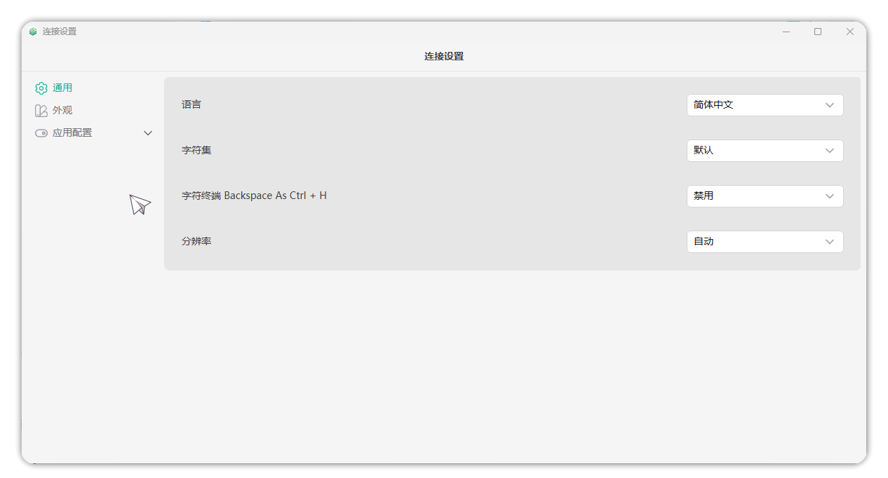
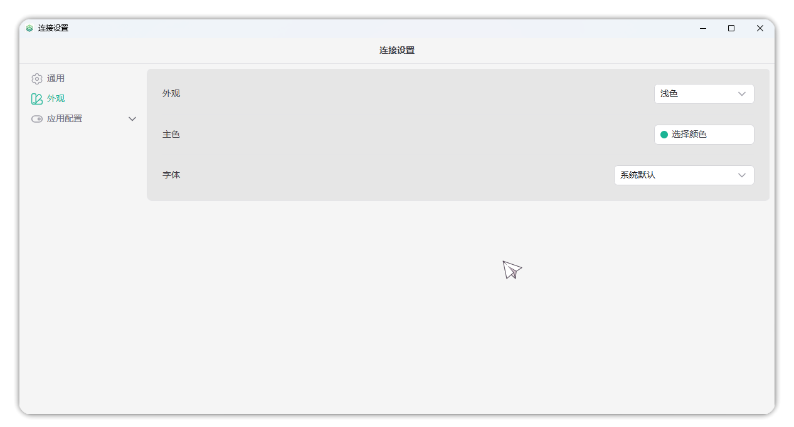
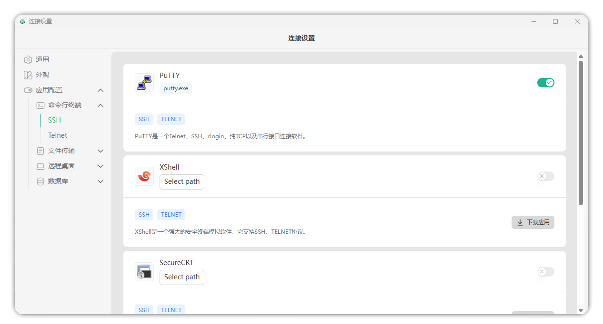
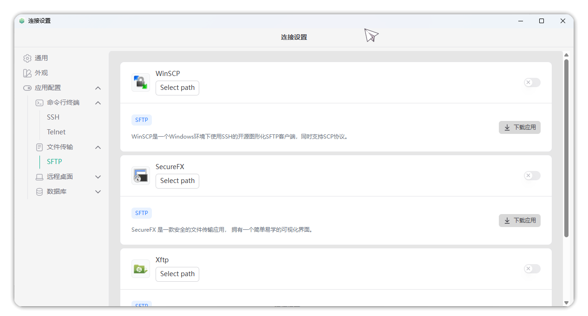
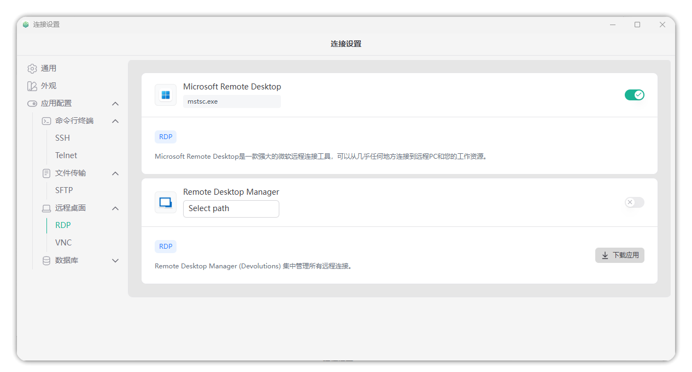
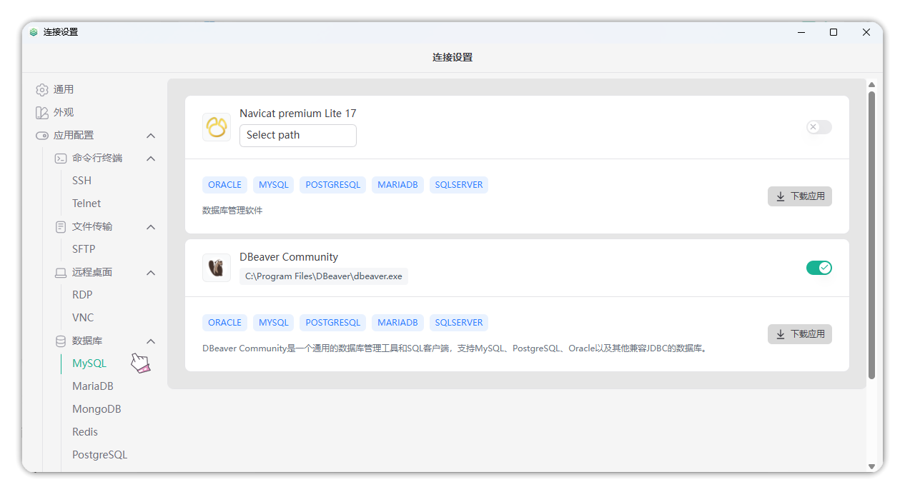

# Connection Settings

!!! tip ""
    - Click the settings button in the top-right corner of the client to open the connection settings page.

## General

!!! tip ""
    - This page allows you to adjust the client's **language**, **character set**, **character terminal settings**, and **resolution**.

## Appearance

!!! tip ""
    - This page allows you to adjust the client's **appearance color**, **primary color**, and **font**.

## Application Configuration

### Command-line Terminal

**SSH**

!!! tip ""
    - This page allows you to adjust local application configuration for connecting to assets through SSH protocol.

**Telnet**

!!! tip ""
    - This page allows you to adjust local application configuration for testing port connections through Telnet protocol; the specific page is similar to SSH.

### File Transfer

**SFTP**

!!! tip ""
    - This page allows you to adjust local application configuration for transferring files through SFTP protocol.

### Remote Desktop

**RDP**

!!! tip ""
    - This page allows you to adjust local application configuration for connecting to assets through RDP protocol.
    - Windows users default to local MSTSC application. Mac users default to Microsoft Remote Desktop application, and need to define RDP file opening method in the system. Linux users need to install and configure Remmina or XFreeRDP.

**VNC**

!!! tip ""
    - This page allows you to adjust local application configuration for connecting to assets through VNC protocol; the specific page is similar to RDP.

### Database

!!! tip ""
    - This page allows you to adjust local application configuration for connecting to database assets, supporting MySQL, MariaDB, MongoDB, Redis, PostgreSQL, Oracle, SQL Server databases.

