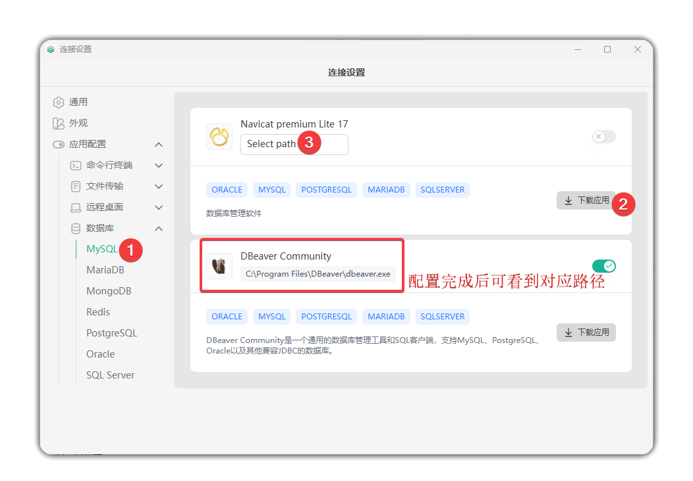

# 数据库资产连接

## 本地客户端配置
在使用客户端方式连接数据库之前，需要先配置本地客户端调用路径，配置方式如下：

1. 点击右上角的设置按钮，进入设置页面
2. 点击 **数据库** ， 会展开支持连接的数据库列表，这里我们以 **MySQL** 为例
3. 选中 **MySQL** 后， 右侧会出现可连接的应用列表并提供下载方式， 点击 **下载应用** 并安装
4. 安装完成后，点击 **Select path** 配置其安装路径后， 即可使用该应用进行数据库的连接

## 连接资产

- 在 **数据库** 资产列表中，点击目标资产名称右侧的 **连接** ，即可自动调用客户端连接资产。
