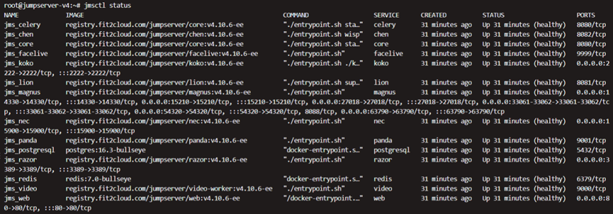

# 系统架构说明

## 1 概述

JumpServer 堡垒机采用微服务架构设计。JumpServer 服务由 Docker 承载，不同的功能模块在不同的容器上面运行；通过 Docker-Compose 以及 jmsctl 管理脚本编排整个 JumpServer 服务的运行与维持不同功能模块之间的依赖关系。

!!! tips ""
    社区版安装包格式：`jumpserver-ce-{{ jumpserver.tag }}-x86_64.tar`  [jumpserver-ce-系统版本-系统架构]

    企业版安装包格式：`jumpserver-ee-{{ jumpserver.tag }}-x86_64.tar`  [jumpserver-ee-系统版本-系统架构]

## 2 依赖组件

JumpServer 堡垒机依赖组件如下：

| 组件名称 | 组件描述 |
| :--- | :--- |
| jms_web | 该组件是 JumpServer 的高性能 HTTP 和反向代理 Web 服务器。 |
| jms_core | 该组件是 JumpServer 的核心组件，主要功能是鉴权和授权中心。|
| jms_celery | 该组件是 JumpServer 的任务调度服务器。 |
| jms_koko | 该组件是 JumpServer 的资产连接组件，以命令行的方式连接 Linux、K8S、数据库等资产。 |
| jms_lion | 该组件是 JumpServer 的资产连接组件，通过浏览器 Web 终端连接 Windows 资产。 |
| jms_chen | 该组件是 JumpServer 的资产连接组件，通过浏览器 Web 终端连接数据库。 |
| jms_magnus | 该组件是 JumpServer 的资产连接组件，通过数据库代理的方式支持用户通过原生的客户端（例如:Navicat、DBeaver 等）对数据库进行直连操作（X-PACK）。 |
| jms_razor | 该组件是 JumpServer 的资产连接组件，通过 JumpServer 客户端的方式拉起个人 PC 原生的远程连接工具 MSTSC，访问 Windows 资产（X-PACK）。 |
| jms_xrdp | 该组件是 JumpServer 的资产连接组件，支持对 Windows 2003 版本的资产进行连接，审计（X-PACK）。 |
| jms_facelive | 该组件是 JumpServer 支持通过人脸识别进行 MFA 认证的组件（X-PACK）。 |
| jms_panda | 该组件是 JumpServer 的 Linux 远程应用发布机的支持组件（X-PACK）。 |
| jms_video | 该组件是 JumpServer 的录像转换 MP4 组件（X-PACK）。 |
| jms_nec | 该组件是服务于客户端方式连接 VNC 协议资产的组件（X-PACK）。 |
| PostgreSQL | 提供数据库服务，存储 JumpServer 核心信息。如果无法提供外置 PostgreSQL，JumpServer 自动运行容器 jms_postgresql。 |
| Redis | 提供数据库信息缓存服务。如果无法提供外置 Redis，JumpServer 自动运行容器 jms_redis。 |

## 3 文件夹用途介绍

JumpServer 的默认安装路径为 `/data/jumpserver`，具体的环境安装路径可通过查看配置文件获取。具体命令如下：

```bash
cat /opt/jumpserver/config/config.txt | grep VOLUME_DIR
```

**主要目录与作用解释：**

| 目录路径 | 作用 |
| :--- | :--- |
| `/opt/jumpserver/config/` | 该目录下保存了各个组件的配置信息。最主要的配置信息为该目录下的 `config.txt` 文件，该文件中保存的是 JumpServer 的核心配置。 |
| `$VOLUME_DIR/core/data/celery/` | 该目录下保存的是异步任务 ansible 队列下的任务日志。此目录下有两层子目录。日志文件最终会以任务 ID 的前两位选择相应的子目录进行存放，日志文件最终以 ID+.log 命名。<br>例如：任务 ID 为：<br>`6a942d0a-52ab-4704-beae-137465ca3eca`；<br>该任务生成的日志文件为：<br>`6a942d0a-52ab-4704-beae-137465ca3eca.log`；<br>存放的路径为：<br>`$VOLUME_DIR/core/data/celery/6/a/` 目录下； |
| `$VOLUME_DIR/core/data/logs/` | 该目录下保存的是 JumpServer 的日志文件。日志文件详细介绍如下：<br>- `ansible.log`：该日志是 ansible 执行自动化任务产生的日志（测试资产可连接性、更新硬件信息、推送账户、执行改密计划等）；<br>- `beat.log`：该日志是定时任务的日志；<br>- `celery_ansible.log`：该日志是异步任务 ansible 队列下的任务日志；<br>- `celery_default.log`：该日志是异步任务默认队列下的任务日志；<br>- `celery.log`：该日志是 celery 组件的日志；<br>- `daphne.log`：该日志是 Django 的一部分，主要用来支持 websocket；<br>- `drf_exception.log`：该日志是使用 DRF 框架抛出的异常信息；<br>- `flower.log`：该日志是作业中心的任务监控组件日志；<br>- `gunicorn.log`：该日志是用来记录 API 请求的日志；<br>- `jumpserver.log`：该日志是 JumpServer 的总日志。 |
| `$VOLUME_DIR/core/data/media/` | 该目录下存放的是远程应用源文件、录像文件、文件上传下载的文件以及自定义的 LOGO 文件等。 |
| `$VOLUME_DIR/core/data/ops/` | 该目录下存放的是用户上传的 playbook 文件。 |
| `$VOLUME_DIR/core/data/static/` | 该目录下存放的是 JumpServer 运行过程中需要的静态文件，例如：img、CSS、js 文件等。 |
| `$VOLUME_DIR/组件名称/data/certs/` | 组件需要的证书信息。 |
| `$VOLUME_DIR/组件名称/data/ftp_files/` | 该目录下临时存放的是通过该组件上传下载的文件内容。 |
| `$VOLUME_DIR/组件名称/data/keys/` | 该目录下存放的是该组件与 core 组件注册时使用的秘钥。 |
| `$VOLUME_DIR/组件名称/data/logs/` | 该目录下存放的是该组件的日志信息。 |
| `$VOLUME_DIR/组件名称/data/replays/` | 该目录下存放的是该组件正在产生的一些会话信息，在该会话结束后，此录像文件会发送给 core 组件。 |
| `$VOLUME_DIR/db_backup` | 该目录下存放的是 JumpServer 数据库的备份文件以及 JumpServer 配置文件的备份。 |
| `$VOLUME_DIR/postgresql/` | 该目录下存放的是 PostgreSQL 的持久化文件（内置数据库） |
| `$VOLUME_DIR/redis/` | 该目录下存放的是 Redis 的配置文件及持久化文件(内置 redis ) |

## 4 服务运行状态

JumpServer 堡垒机的模块都是独立打包和运行的，基于微服务的架构和容器化部署。可以通过 `jmsctl status` 命令获取当前组件容器的运行状态。

