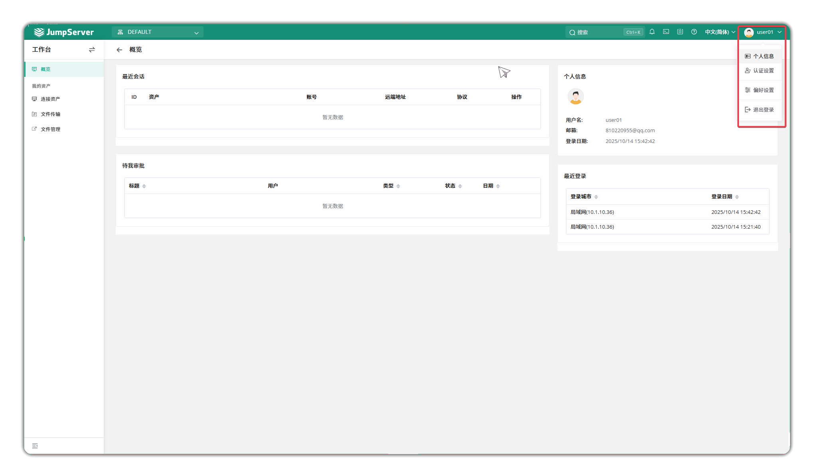
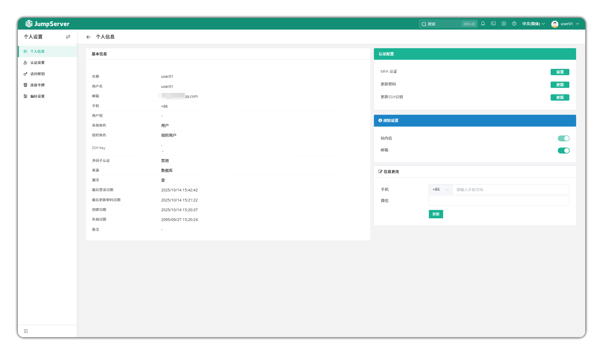
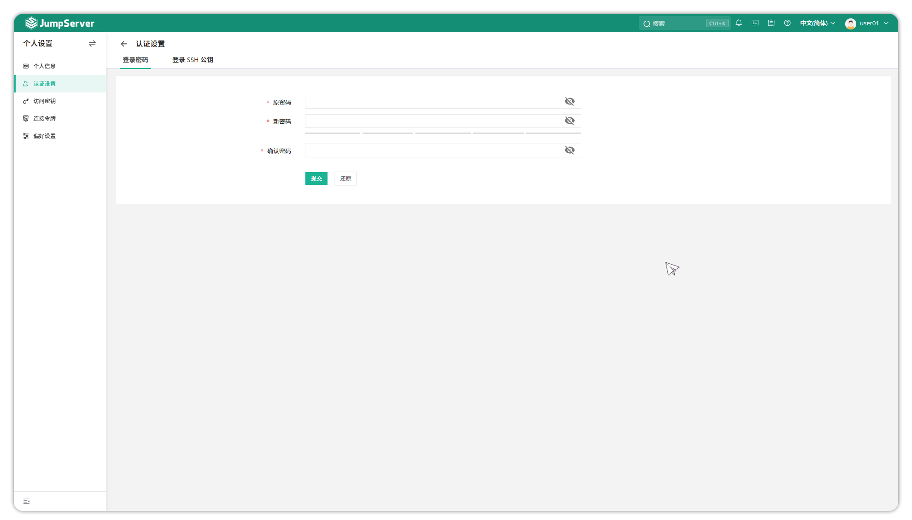
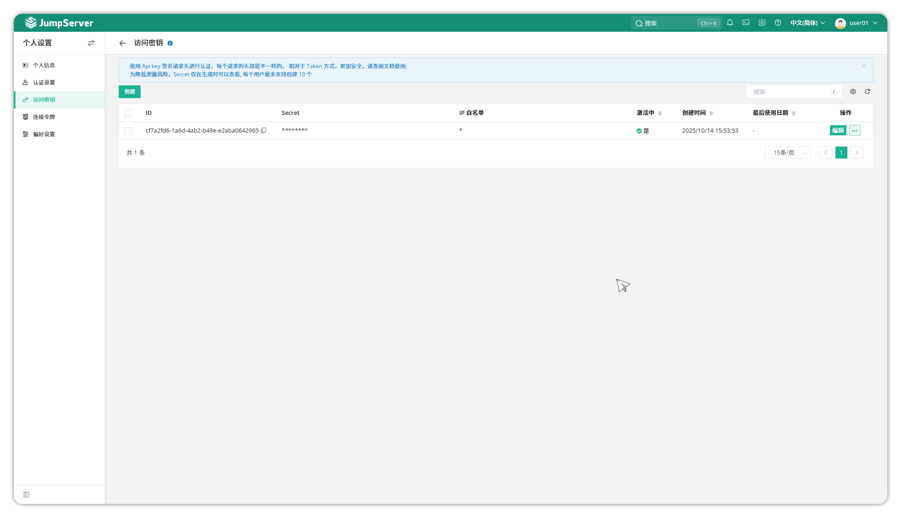
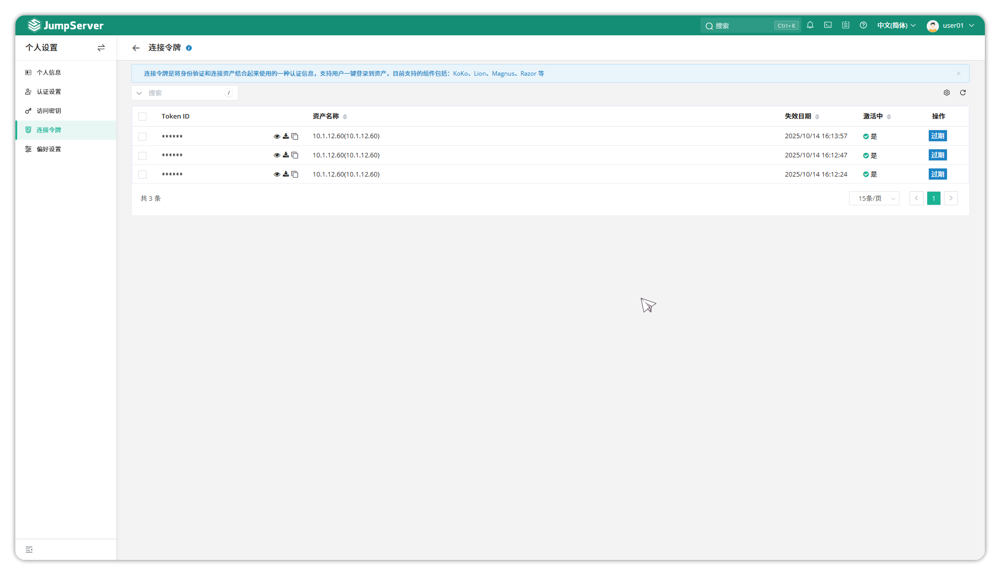
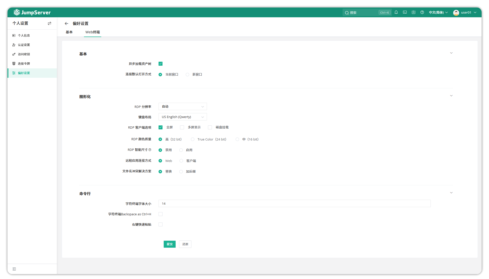

#  个人信息
!!! tip ""
    - 点击页面右上角的<用户名称>按钮进入个人信息界面，该页面主要查看个人账号信息，设置个人信息临时密码等等。

## 个人信息
!!! tip ""
    - 该页面可以查看普通用户的基本信息。同时，在该页面可以进行一些认证配置，例如MFA
    认证、密码、SSH密钥登录信息等；如果管理员用户配置了企业微信、钉钉认证等，还可
    以在此页面绑定相应的账号认证信息。另外，此页面还可以设置消息订阅，默认包含站内信
    和邮件设置，如果管理员配置了企业微信、钉钉等，还可以在此处开启相关的消息订阅。

## 认证设置
!!! tip ""
    - 普通用户在个人信息页面可对本人账号信息进行相应的认证配置和消息订阅配置，可以查看和设置用户的认证信息，包括密码、SSH密钥登录信息。
    - 登陆密码设置：普通用户可在此页面自行更新当前账户的密码；
    - SSH公钥设置：普通用户可在此页面自行设置SSH公钥并下载，在使用SSH终端登录堡垒机时使用该公钥。

## 访问密钥
!!! tip ""
    - 访问密钥是用户通过API访问堡垒机的一种方式，用户可以在此页面查看和生成访问密钥。
    - 生成访问密钥：用户可以点击“生成访问密钥”按钮生成访问密钥，生成后请妥善保存，访问密钥生成后无法再次查看，请妥善保管。

## 连接令牌
!!! tip ""
    - 连接令牌是将身份验证和连接资产结合起来使用的一种认证信息，支持用户一键登录到资产，
    目前支持的组件包括：KoKo、Lion、Magnus、Razor 等。用户可以自行查看连接令牌信
    息并使令牌过期,连接令牌的创建方式如下：
    - 连接SSH协议资产：通过Web终端连接Linux资产，选择连接方式为“客户端”，即
    可创建令牌信息；
    - 连接RDP协议资产：通过Web 终端连接RDP资产，选择连接方式为“客户”，即可
    创建令牌信息；
    - 连接数据库应用：通过 Web 终端连接数据库应用，选择连接方式为“数据库客户端”，
    即可创建令牌信息；
    - 通过调用API 方式创建。

## 偏好设置
!!! tip ""
    - 用户可自行在“偏好设置”页面对 web 终端的服务进行配置。

**基本**
!!! tip ""
    
    点击个人设置页面中的左侧页签<基本>
    按钮，可以对从JumpServer页面导出文件进行加
    密密码的设置。

**Web终端**    
!!! tip ""
    
    点击个人设置页面中的中间页签<Web终端>按钮，对Web终端页面资产连接时的参数进行设置

详细配置解释:

| 配置项 | 说明 |
| --- | --- |
| 异步加载资产树 | 资产连接中是否实时加载资产树。 |
| 连接默认打开方式 | 默认“当前窗口” |
| RDP分辨率 | 修改RDP分辨率，默认“自动”。 |
| 键盘布局 | 选择连接 Windows 资产时使用的键盘布局。 |
| RDP客户端选项 | RDP 客户端连接是否开启全屏，多屏显示与磁盘挂载。 |
| RDP颜色质量 | 选择远程会话的颜色深度。 |
| RDP智能尺寸 | 调整窗口大小时客户端计算机是否应缩放远程计算机上的内容以适应客户端计算机的窗口大小。 |
| 远程应用连接方式 | 选择远程应用的连接方式，Web 或者客户端方式。 |
| 文件名冲突解决方案 | 当通过KOKO组件进行文件上传时，上传的文件跟原本目录中的文件冲突时选择替换原文件或者在新上传的文件中添加后缀。 |
| 字符终端字体大小 | 设置终端字体的大小显示。 |
| 字符终端 Backspace AS Ctrl+H | 在命令行中是否开启快捷键 Ctrl+H 作为删除键。 |
| 右键快速粘贴 | 命令行是否开启右键快速粘贴。 |