# Personal Profile
!!! tip ""
    - Click the **Username** button in the top right corner of the page to enter the **Personal Profile** interface. This page mainly displays personal account information and allows you to set personal temporary passwords and other configurations.

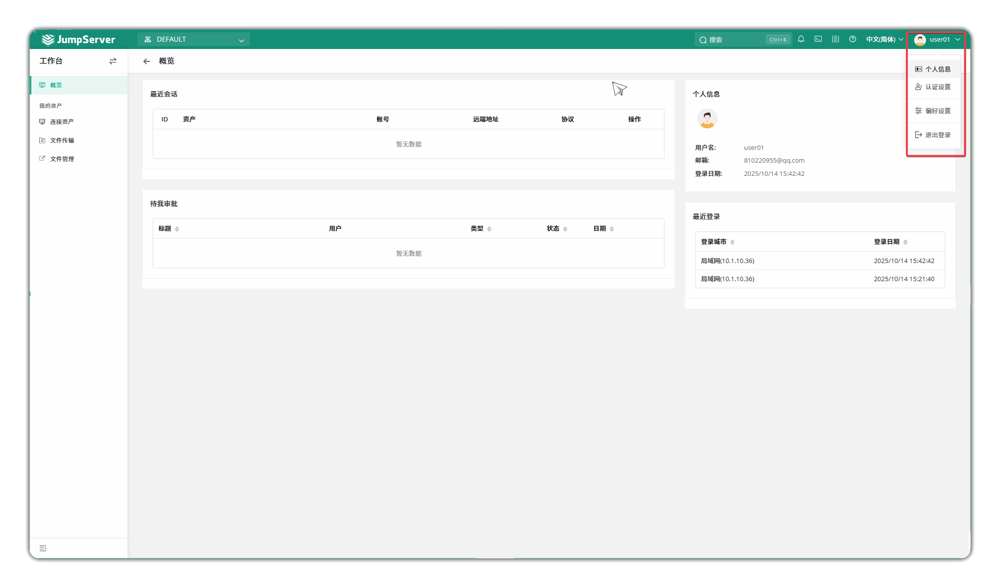
## 1 Personal Information
!!! tip ""
    - This page displays basic information for regular users. On this page, you can also perform authentication configurations, such as MFA authentication, passwords, SSH key login information, etc. If the administrator has configured enterprise WeChat, DingTalk authentication, etc., you can also bind the corresponding account authentication information on this page. Additionally, this page allows you to set message subscriptions, which by default include in-site messages and email settings. If the administrator has configured enterprise WeChat, DingTalk, etc., you can also enable related message subscriptions here.
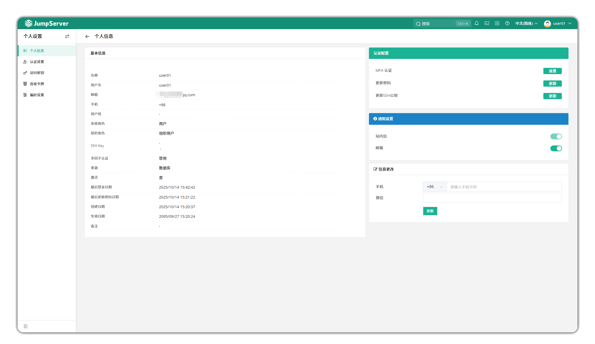

## 2 MFA Authentication

!!! tip ""
    - MFA (Multi-Factor Authentication) refers to adding an additional layer of security verification beyond username and password authentication, such as SMS verification codes, email verification codes, dynamic tokens, etc. JumpServer supports multiple MFA authentication methods. Users can click **MFA Authentication** on the **Authentication Configuration** panel on the right side of the personal profile page to configure it.

**OTP Dynamic Token**
!!! tip ""
    - OTP (One-Time Password) is a dynamic password where a new password is required for each authentication, generated by a dynamic token device.
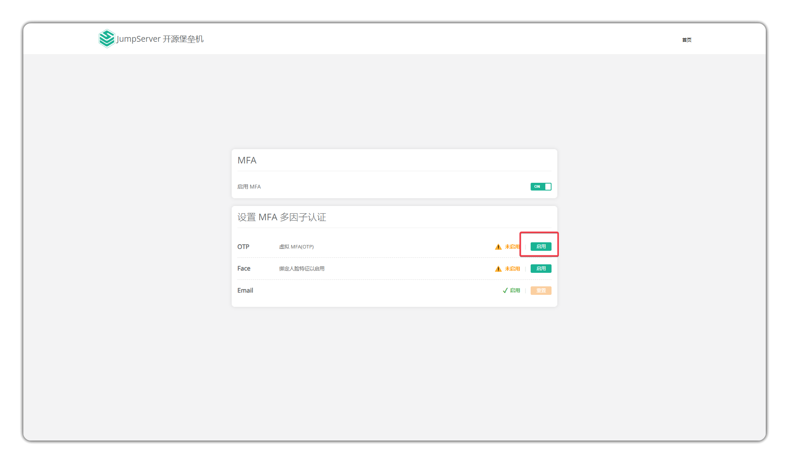

- After clicking to enter the configuration page, download the relevant application according to the instructions and bind it as prompted.

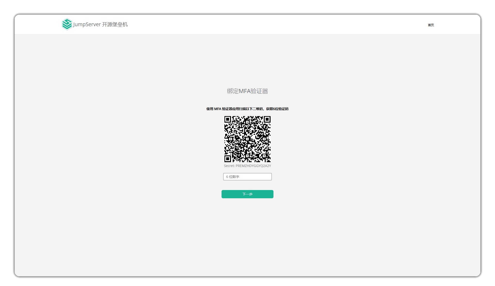

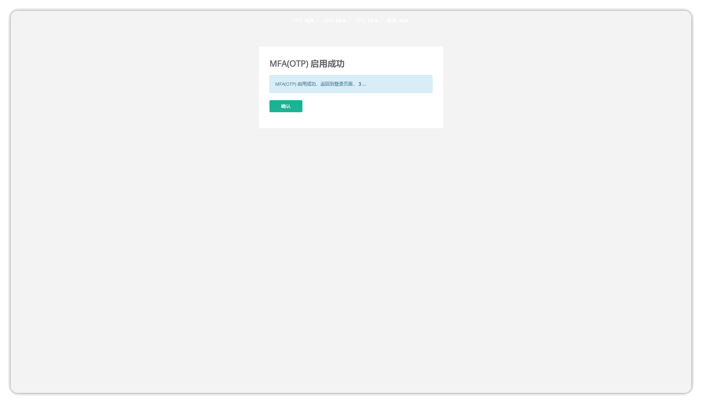

- After successful configuration, when users complete login with username and password, they need to enter the dynamic token for two-factor verification.

**Face Recognition**

**1 Configure MFA Face Recognition**
**Record facial information on the user details page and enable MFA**

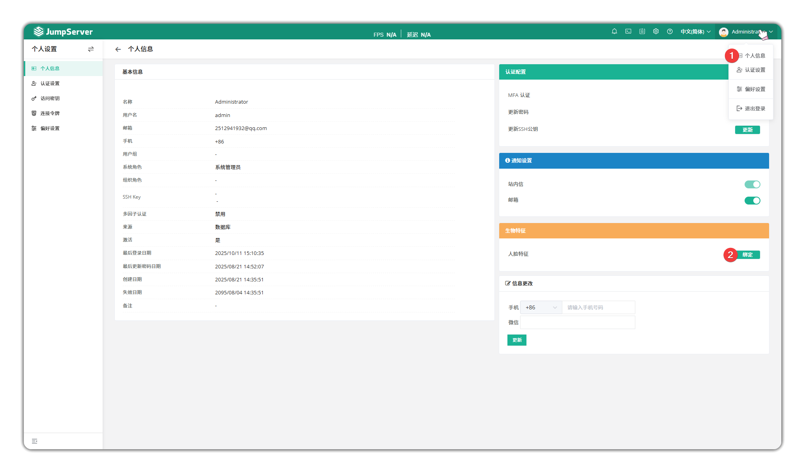

**Log out and attempt to log in again, select face verification**
 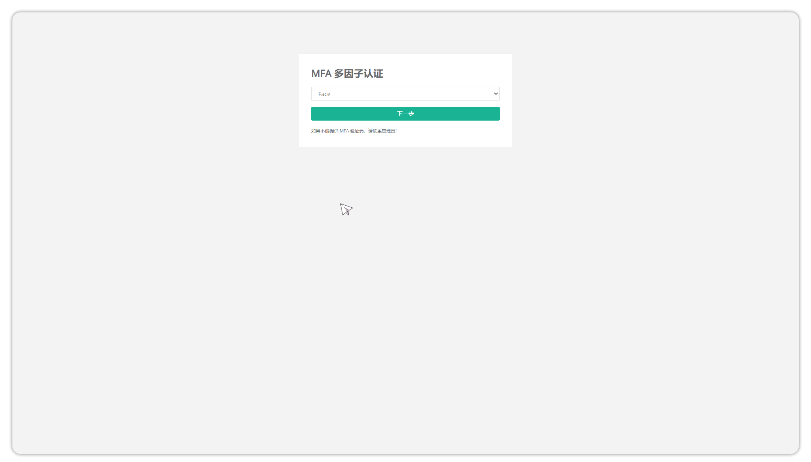

**Complete face verification within 30 seconds**
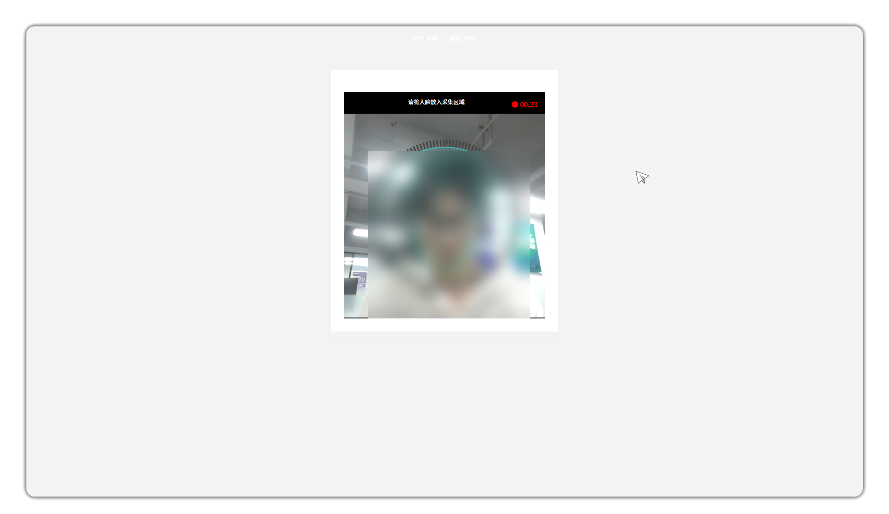

**Email Verification**

- You can use email verification codes as two-factor verification. Users can complete login by entering the email verification code during login.
- Enable email functionality in the personal information section
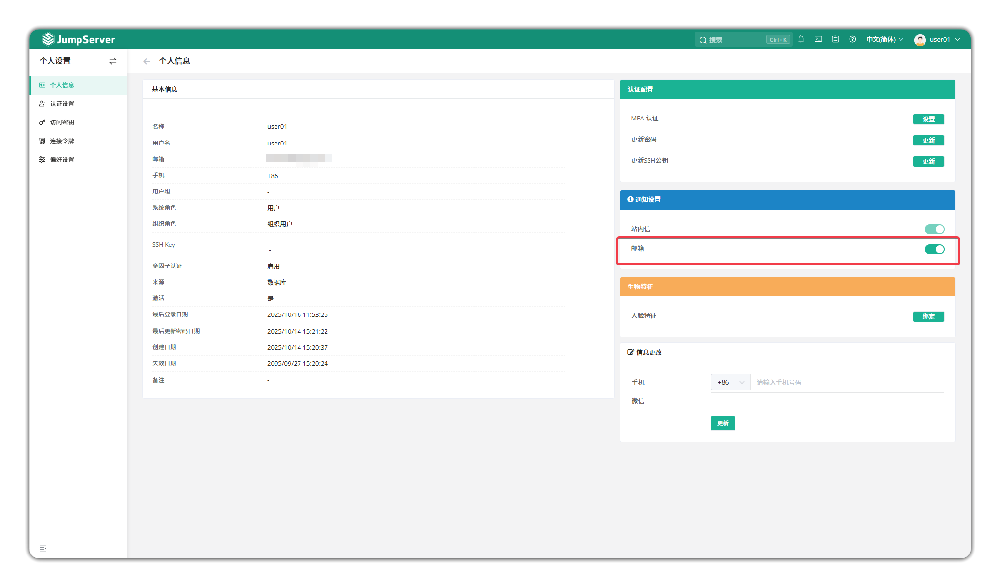
- Enable email verification in System Settings > Notification Settings and configure the email server information.
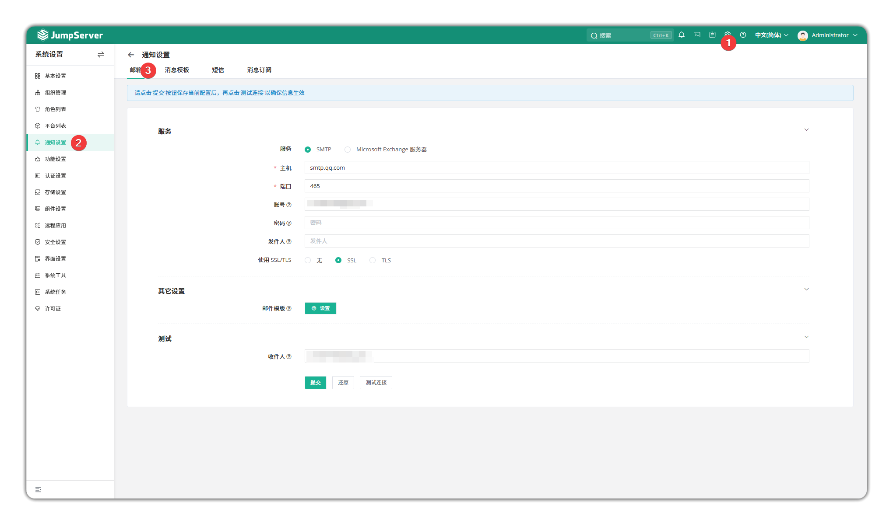
- Select Email in the MFA authentication methods after login and enter the corresponding verification code to complete login.
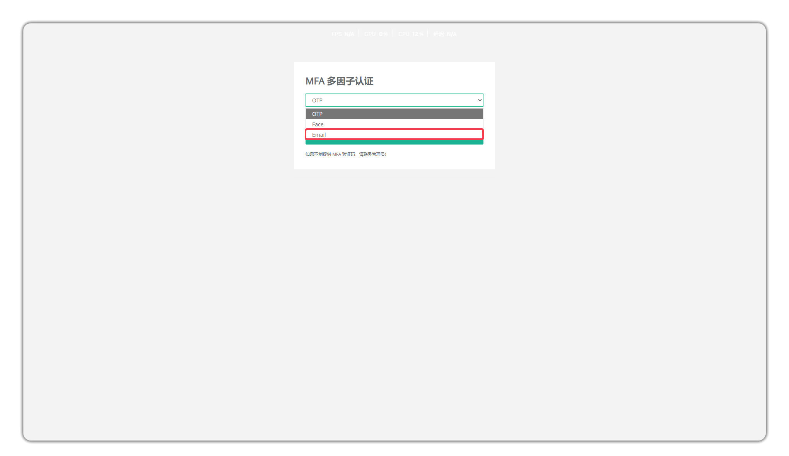

**SMS Authentication**

- You can use SMS verification codes as two-factor verification. Users can complete login by entering the SMS verification code during login.
- Bind your phone number in the personal information section to enable SMS verification
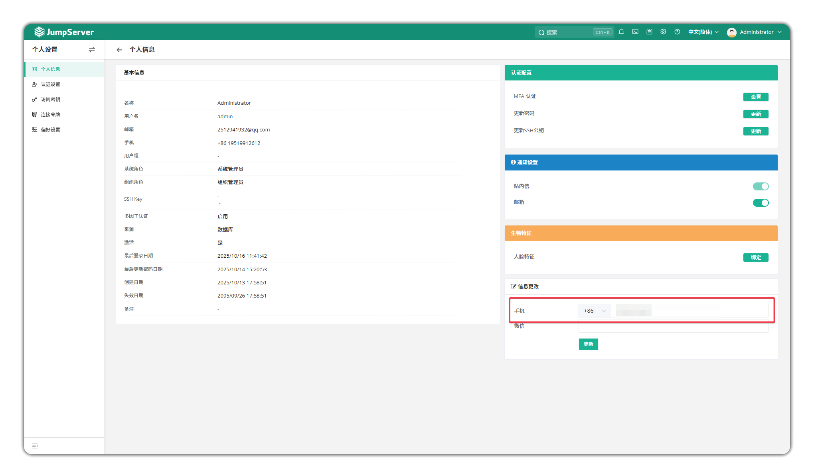

- Select SMS in the MFA authentication methods after login and enter the corresponding verification code to complete login.
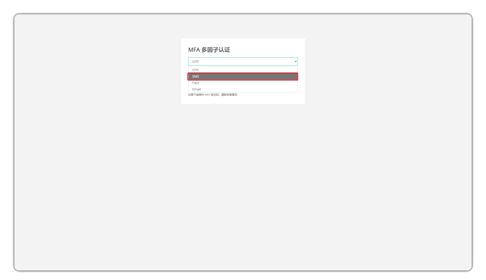

## 3 Authentication Settings
!!! tip ""
    - Regular users can perform authentication configuration and message subscription configuration for their own accounts on the personal profile page. You can view and set user authentication information, including passwords and SSH key login information.
    - Login Password Settings: Regular users can update their current account password on this page.
    - SSH Public Key Settings: Regular users can set SSH public keys and download them on this page, which are used when logging in to the bastion host using SSH terminal.
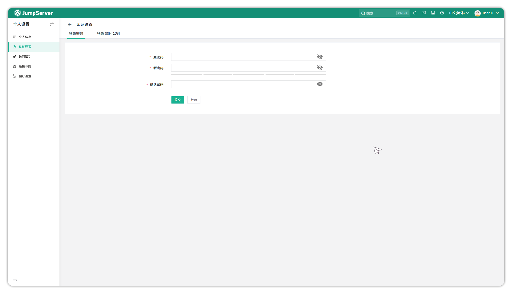

## 4 Access Keys
!!! tip ""
    - Access keys are a way for users to access the bastion host through the API. Users can view and generate access keys on this page.
    - Generate Access Key: Users can click the **Generate Access Key** button to generate one. After generation, please save it properly. After the access key is generated, it cannot be viewed again, so please keep it safely.
    - This API key permissions are consistent with the current user role permissions.
    - For API documentation, refer to: https://<bastion host address>/api/docs/.
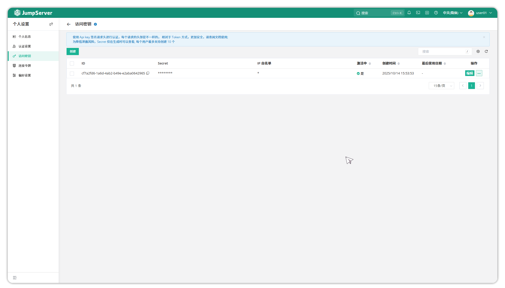

## 5 Connection Token
!!! tip ""
    - Connection tokens are a type of authentication information that combines authentication with asset connection, supporting one-click login to assets. Currently supported components include: KoKo, Lion, Magnus, Razor, etc. Users can view connection token information and expire tokens. The creation methods for connection tokens are as follows:
    - Connect to SSH protocol assets: Connect to Linux assets through the web terminal and select the connection method as **Client** to create token information.
    - Connect to RDP protocol assets: Connect to RDP assets through the web terminal and select the connection method as **Client** to create token information.
    - Connect to database applications: Connect to database applications through the web terminal and select the connection method as **Database Client** to create token information.
    - Create by calling the API method.

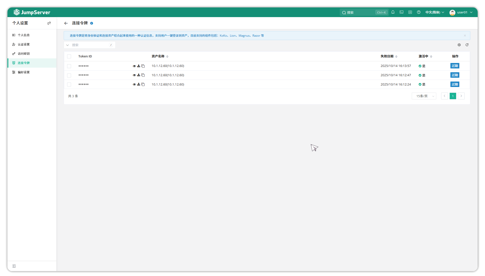

## 6 Preferences
!!! tip ""
    - Users can configure the web terminal service on the **Preferences** page.

### 6.1 **Basic**
!!! tip ""
    - Click the **Basic** button on the left side of the personal settings page to set encryption passwords for files exported from the JumpServer page.
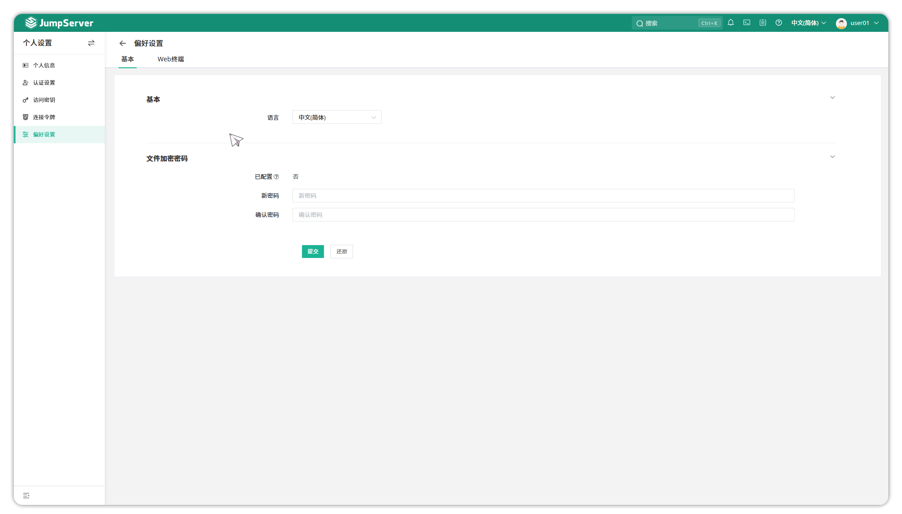

### 6.2 **Web Terminal**    
!!! tip ""
    Click the **Web Terminal** button in the middle of the personal settings page to configure parameters when connecting to assets on the web terminal page.
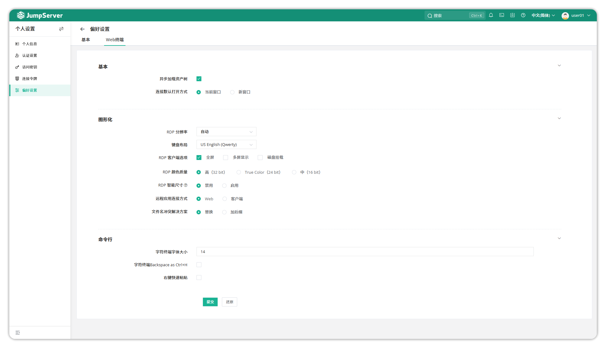    

Detailed configuration explanation:

| Configuration Item | Description |
| --- | --- |
| Asynchronous Asset Tree Loading | Whether to load the asset tree in real-time during asset connection. |
| Default Connection Method | Default **Current Window** |
| RDP Resolution | Change RDP resolution. Default **Auto**. |
| Keyboard Layout | Select the keyboard layout to use when connecting to Windows assets. |
| RDP Client Options | Whether to enable fullscreen, multi-monitor display, and disk mounting for RDP client connections. |
| RDP Color Quality | Select the color depth for remote sessions. |
| RDP Smart Sizing | Whether the client computer should scale the content on the remote computer to fit the client window size when adjusting window size. |
| Remote Application Connection Method | Select the connection method for remote applications, web or client method. |
| File Name Conflict Resolution | When uploading files through the KOKO component, if the uploaded file conflicts with files in the original directory, select whether to replace the original file or add a suffix to the newly uploaded file. |
| Character Terminal Font Size | Set the display size of terminal font. |
| Character Terminal Backspace AS Ctrl+H | Whether to enable the Ctrl+H shortcut key as the delete key in the command line. |
| Right-Click Quick Paste | Whether to enable right-click quick paste in the command line. |
