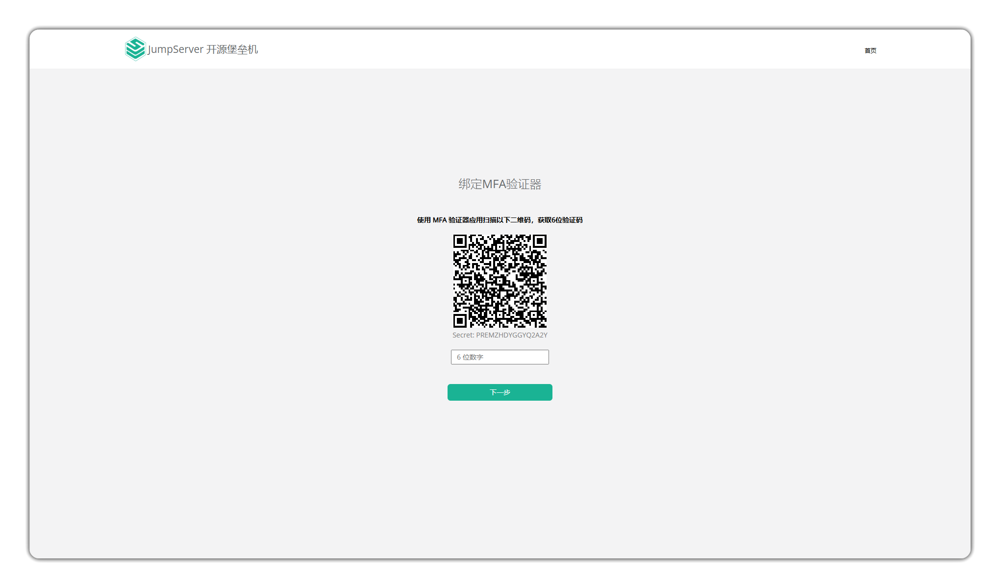
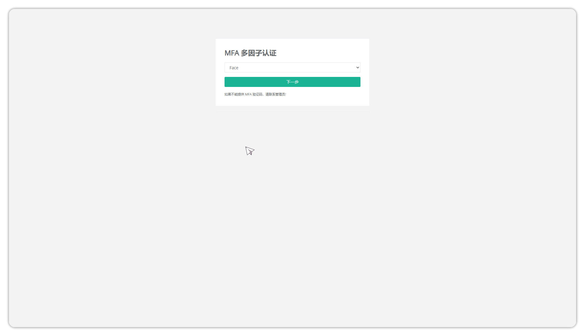

#  个人信息
!!! tip ""
    - 点击页面右上角 **用户名称** 按钮进入 **个人信息** 界面，该页面主要查看个人账号信息，设置个人信息临时密码等等。

## 1.个人信息
!!! tip ""
    - 该页面可以查看普通用户的基本信息。同时，在该页面可以进行一些认证配置，例如MFA
    认证、密码、SSH密钥登录信息等；如果管理员用户配置了企业微信、钉钉认证等，还可
    以在此页面绑定相应的账号认证信息。另外，此页面还可以设置消息订阅，默认包含站内信
    和邮件设置，如果管理员配置了企业微信、钉钉等，还可以在此处开启相关的消息订阅。

## 2.MFA 认证

!!! tip ""
    - MFA（Multi-Factor Authentication）即多因素认证，是指在用户名和密码认证的基础上，再增加一层安全验证，例如短信验证码、邮箱验证码、动态令牌等。JumpServer 支持多种 MFA 认证方式，用户可以在个人信息页面 右侧 **认证配置** 栏点击 **MFA 认证** 进行配置。

**OTP动态令牌**
!!! tip ""
    - OTP（One-Time Password）即一次性密码，是一种动态密码，每次认证时都需要输入新的密码，该密码由动态令牌生成。

- 点击进入配置页面后根据内容下载相关 应用程序，并按照提示进行绑定。

- 配置成功后相关用户填写完成用户名密码后登录时需要输入动态令牌完成二次验证。

**Face**

**1 配置 MFA 人脸识别**
**在用户详细信息页面记录面部信息并启用 MFA**

**退出登录并尝试重新登录，选择人脸验证**
 

**请在30秒内完成面部验证**

**邮箱验证**

- 可以使用邮箱验证码作为二次验证，用户在登录时输入邮箱验证码即可完成登录。
- 在个人信息栏中开启邮箱功能

- 在系统设置 > 通知设置 中开启邮箱验证功能，并配置邮箱服务器信息。

- 在登录后的 MFA 认证方式中选择 Email，输入对应的验证码即可完成登录。

**SMS 认证**

- 可以使用短信验证码作为二次验证，用户在登录时输入短信验证码即可完成登录。
- 在个人信息栏中绑定手机号以启用短信验证功能

- 在登录后的 MFA 认证方式中选择 SMS, 输入对应的验证码即可完成登录。

## 3.认证设置
!!! tip ""
    - 普通用户在个人信息页面可对本人账号信息进行相应的认证配置和消息订阅配置，可以查看和设置用户的认证信息，包括密码、SSH 密钥登录信息。
    - 登陆密码设置：普通用户可在此页面自行更新当前账户的密码。
    - SSH 公钥设置：普通用户可在此页面自行设置 SSH 公钥并下载，在使用 SSH 终端登录堡垒机时使用该公钥。

## 4.访问密钥
!!! tip ""
    - 访问密钥是用户通过 API 访问堡垒机的一种方式，用户可以在此页面查看和生成访问密钥。
    - 生成访问密钥：用户可以点击生成 **访问密钥** 按钮生成，生成后请妥善保存，访问密钥生成后无法再次查看，请妥善保管。
    - 此 API 密钥权限和当前用户角色权限保持一致。
    - API 文档请参考：https://<堡垒机地址>/api/docs/。

## 5.连接令牌
!!! tip ""
    - 连接令牌是将身份验证和连接资产结合起来使用的一种认证信息，支持用户一键登录到资产，
    目前支持的组件包括：KoKo、Lion、Magnus、Razor 等。用户可以自行查看连接令牌信
    息并使令牌过期,连接令牌的创建方式如下：
    - 连接SSH协议资产：通过 Web 终端连接Linux资产，选择连接方式为 **客户端**，即
    可创建令牌信息；
    - 连接RDP协议资产：通过 Web 终端连接RDP资产，选择连接方式为 **客户端**，即可
    创建令牌信息；
    - 连接数据库应用：通过 Web 终端连接数据库应用，选择连接方式为 **数据库客户端**，
    即可创建令牌信息；
    - 通过调用API 方式创建。

## 6.偏好设置
!!! tip ""
    - 用户可自行在 **偏好设置** 页面对 web 终端服务进行配置。

### 6.1 **基本**
!!! tip ""
    - 点击个人设置页面中的左侧页签 **基本** 按钮，可以对从JumpServer页面导出文件进行加密密码的设置。

### 6.2 **Web终端**    
!!! tip ""
    点击个人设置页面中的中间页签 **Web终端** 按钮，对 Web 终端页面资产连接时的参数进行设置
    

详细配置解释:

| 配置项 | 说明 |
| --- | --- |
| 异步加载资产树 | 资产连接中是否实时加载资产树。 |
| 连接默认打开方式 | 默认 **当前窗口** |
| RDP 分辨率 | 修改 RDP 分辨率，默认 **自动**。 |
| 键盘布局 | 选择连接 Windows 资产时使用的键盘布局。 |
| RDP 客户端选项 | RDP 客户端连接是否开启全屏，多屏显示与磁盘挂载。 |
| RDP 颜色质量 | 选择远程会话的颜色深度。 |
| RDP 智能尺寸 | 调整窗口大小时客户端计算机是否应缩放远程计算机上的内容以适应客户端计算机的窗口大小。 |
| 远程应用连接方式 | 选择远程应用的连接方式，Web 或者客户端方式。 |
| 文件名冲突解决方案 | 当通过KOKO组件进行文件上传时，上传的文件跟原本目录中的文件冲突时选择替换原文件或者在新上传的文件中添加后缀。 |
| 字符终端字体大小 | 设置终端字体的大小显示。 |
| 字符终端 Backspace AS Ctrl+H | 在命令行中是否开启快捷键 Ctrl+H 作为删除键。 |
| 右键快速粘贴 | 命令行是否开启右键快速粘贴。 |