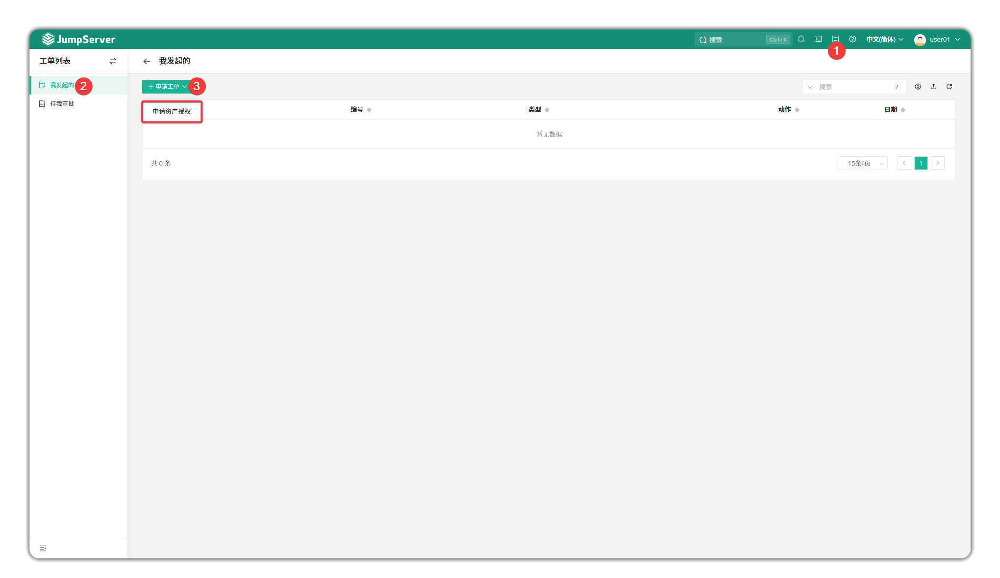
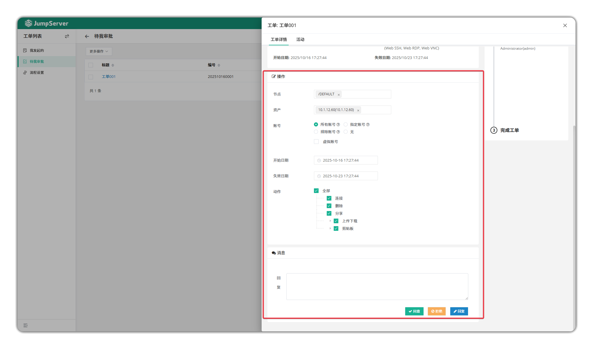
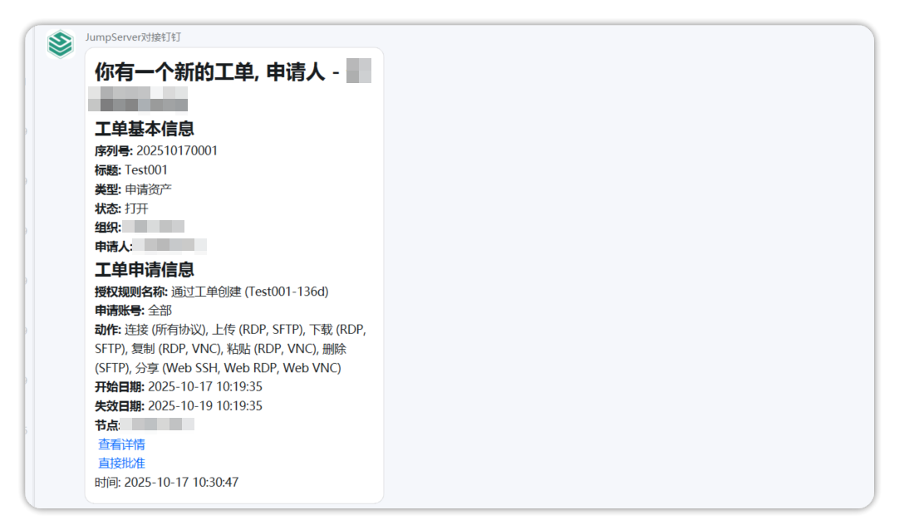

# 工单
!!! tip ""
    - 工单功能主要负责授权工单的申请与审核、命令过滤与资产登录的审核。JumpServer 授权申请支持二级审批流程；工单功能支持对用户登录请求行为以及命令过滤功能进行控制。用户点击申请、申请授权工单信息，根据设置完成的流程对应的审批人审批通过后，用户即可获得申请资产的权限或用户登录请求与命令过滤
  
## 我发起的
- 我发起的页面主要查看由用户创建的工单的详情记录， 在该页面可以申请工单
  
**申请工单**

参数说明

| 参数               | 说明                                                               |
|--------------------|--------------------------------------------------------------------|
| 标题               | 该工单的标题。                                                     |
| 组织             | 该工单所申请的权限以及JumpServer用户所处的组织。                   |
| 节点               | JumpServer 用户申请的资产，节点指申请整个节点下所有资产的权限。   |
| 资产               | JumpServer 用户申请的资产。                                       |
| 申请账号           | JumpServer 用户申请的资产所使用的登录账号。                       |
| 操作               | JumpServer 用户申请拥有的动作权限。                               |
| 开始日期、失效日期 | 用户申请的权限使用的期限。                                         |

**查看工单**

- 点击创建好的<工单标题>按钮，可进入工单详情页中。工单详情页中包含该工单的基本信息、申请信息以及审批人，同时该页面可以与审批人进行对话。

**取消工单**

- 在工单详情页可以手动取消工单

## 待我审批

- 在待我审批页面，点击<工单名称>按钮，对工单进行查阅审批。审批人查看工单时，可修改申请人申请的资产、账号、操作等权限。

- 除了在JumpServer页面进行审批外，JumpServer还支持企业微信、钉钉直接审批工单信息。当审批人的企业微信或者钉钉绑定后，审批人可实时在企业微信或钉钉上对申请人的工单进行审批。

