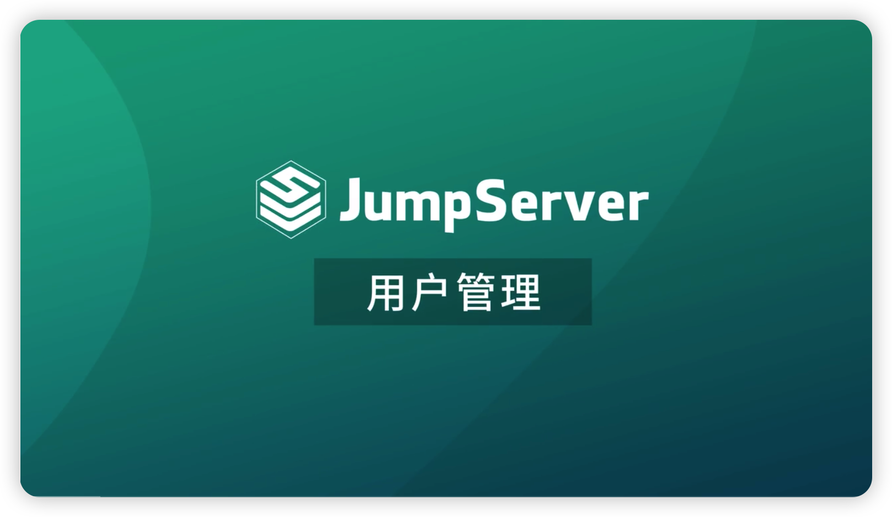
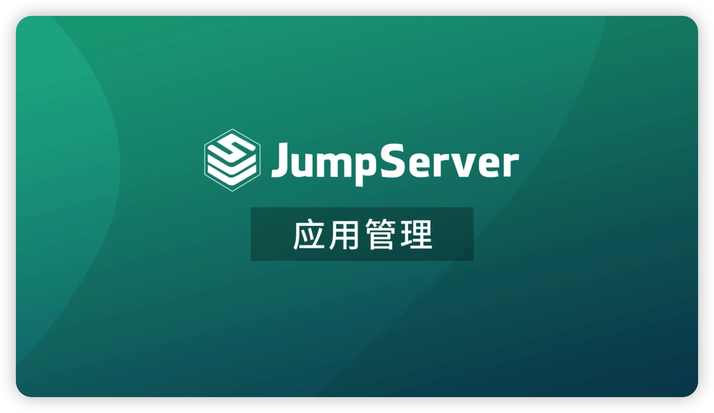
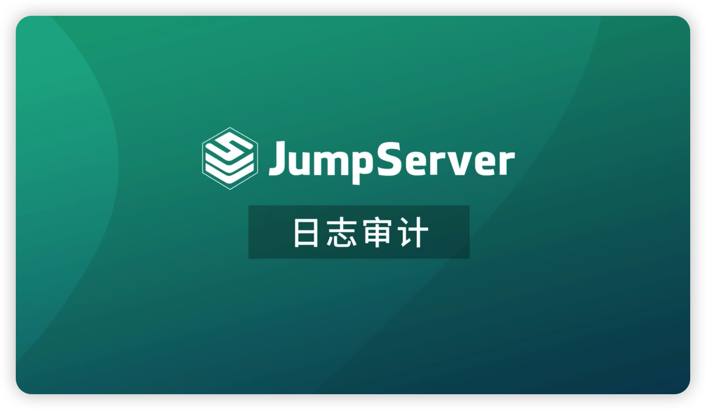
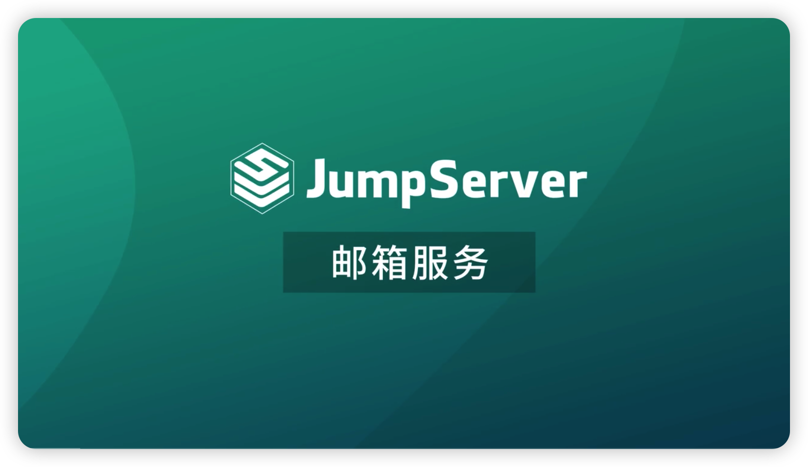
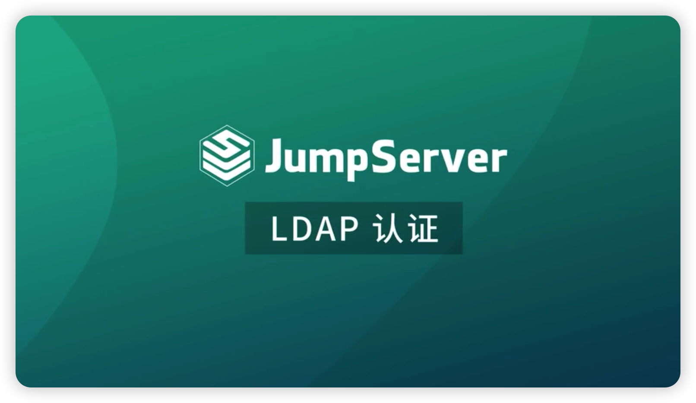

# Teaching Videos

## 1 Installation and Deployment

[{ width="280"}](https://www.bilibili.com/video/BV1vR4y1w7sG/?spm_id_from=333.788&vd_source=202cc7e93ceb73b966c426555ab06c3f)

## 2 Asset Management
[{ width="280"}](https://www.bilibili.com/video/BV1Nt4y1s7qe/?spm_id_from=333.788&vd_source=202cc7e93ceb73b966c426555ab06c3f)
[{ width="280"}](https://www.bilibili.com/video/BV1L5411X7XV/?spm_id_from=333.788&vd_source=202cc7e93ceb73b966c426555ab06c3f)
[{ width="280"}](https://www.bilibili.com/video/BV1954y1Z7wo/?spm_id_from=333.788&vd_source=202cc7e93ceb73b966c426555ab06c3f)  
[{ width="280"}](https://www.bilibili.com/video/BV1k54y1d7xs/?spm_id_from=333.788&vd_source=202cc7e93ceb73b966c426555ab06c3f)
[{ width="280"}](https://www.bilibili.com/video/BV19g411d7Mx/?spm_id_from=333.788&vd_source=202cc7e93ceb73b966c426555ab06c3f)

## 3 Log Audit
[{ width="280"}](https://www.bilibili.com/video/BV1ua411E7PP/?spm_id_from=333.788&vd_source=202cc7e93ceb73b966c426555ab06c3f)

## 4 Other Configuration
[{ width="280"}](https://www.bilibili.com/video/BV18R4y1w7pG/?spm_id_from=333.788&vd_source=202cc7e93ceb73b966c426555ab06c3f)
[{ width="280"}](https://www.bilibili.com/video/BV13T4y1q7g3/?spm_id_from=333.788&vd_source=202cc7e93ceb73b966c426555ab06c3f)
