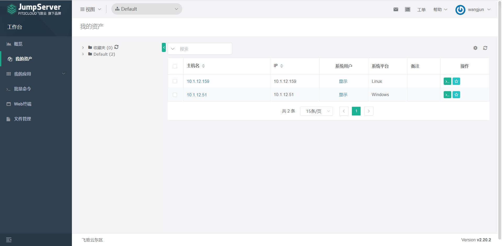
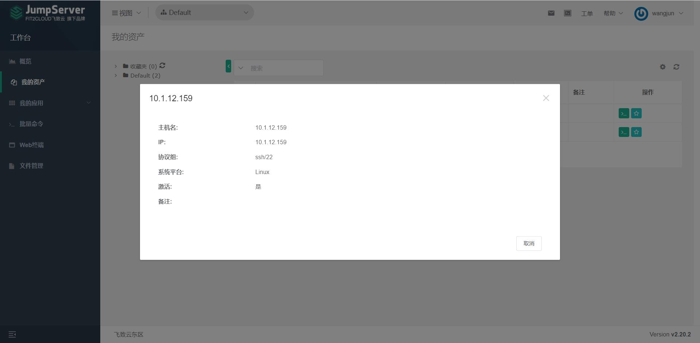

# 我的资产

!!! info "我的资产"
    点击“我的资产”按钮，进入我的资产，则可以看到已经授权给当前用户的资产和所属节点。

!!! info "资产详情"
    点击名称可以查看该资产的具体情况。

!!! info "快速登录"
    点击资产后方操作栏的第一个按钮，可以快速登录资产的web操作界面。

!!! info "收藏资产"
    操作栏第二个按钮可以标注星标，并放入“Web终端”页面的收藏夹中，便于在 Web 终端快速查找该资产。
