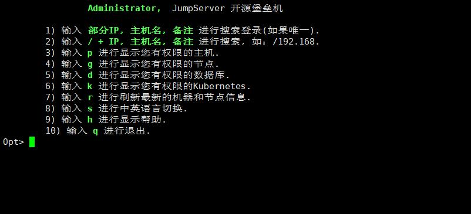

# 终端工具登录

在Windows客户端，使用远程访问工具连接堡垒机2222 端口，登录堡垒机从而连接资产。这里以Xshell为例，如下：
1、在Xshell客户端配置堡垒机IP和2222端口，配置使用当前堡垒机用户名和密码或密钥；

2、用户认证：输入堡垒机账号、密码及MFA（如开启，未开启则忽略）二次认证6位认证数字；

3、登入成功：登入成功后，来到欢迎页面，熟悉操作命令，特别是帮助命令，按命令说明进行操作：

4、访问资产：输入p显示有权限的资产，输入需要登入的资产编号或IP，选择对应系统用户访问资产：
