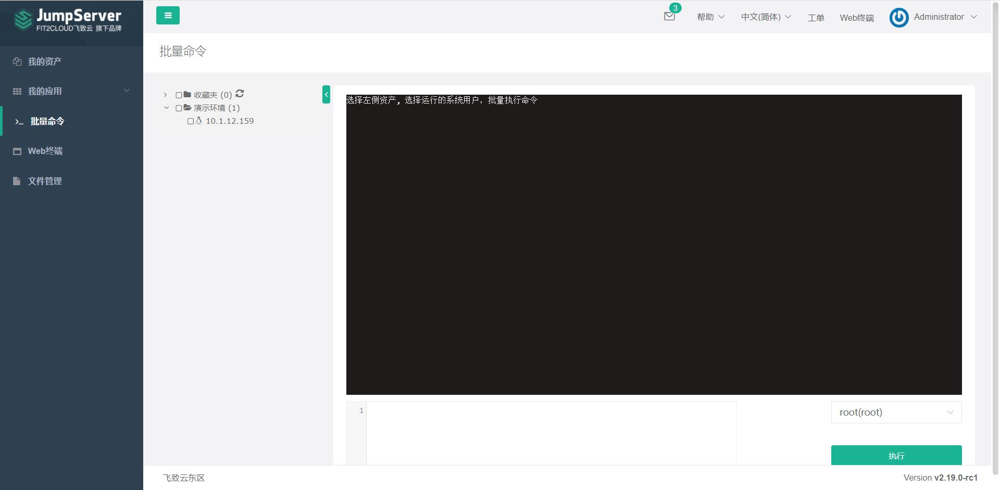

# 批量命令

!!! info "通过 web 下发命令"
    批量命令的作用是对有权限的资产进行批量命令处理；
	在资产数中选择对应资产，右下角系统用户处选择授权的系统用户，中间文本框中，输入命令，点击执行即可。  
!!! tip "受限于当前集成的ansible自动化模块，仅支持ssh协议的资产自动化，且每次任务建议并发数不大于一百，以保证稳定运行。"
!!! tip "仅支持标准的 shell 命令，如: sudo ifconfig" 
     

