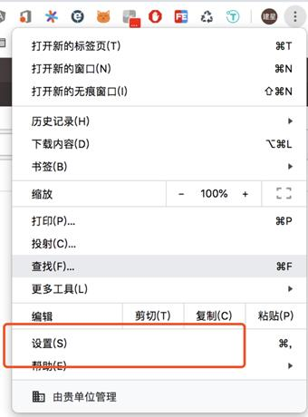
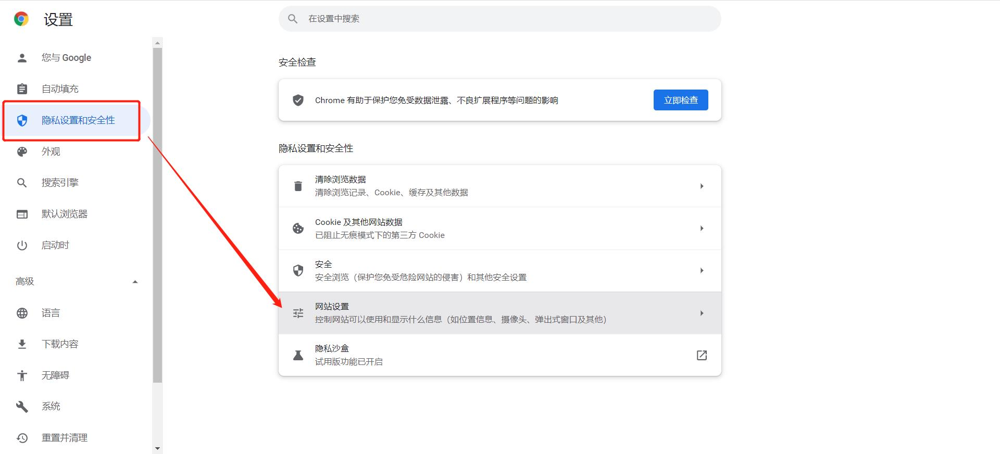
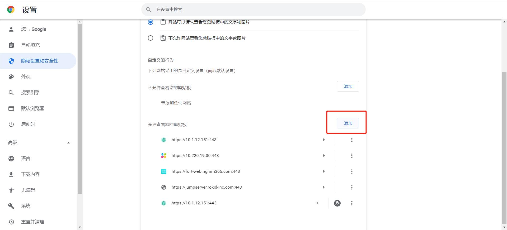

# Windows WebGUI方式复制粘贴

!!! info "方式一："
在会话页面右上角，将需要粘贴的文字，拷贝进空白处，即可使用粘贴快捷键或右键粘贴实现文字粘贴进资产，该功能面板相当于剪切板。

!!! info "方式二："
启用https，可实现直接复制粘贴功能： 仅支持Chrome浏览器的直接复制粘贴，点击Chrome的菜单拦，点击设置：

!!! tip "选择网站设置："

!!! tip "选择剪贴板："

!!! tip "添加堡垒机地址，注意地址必须是https的："

设置完成即可直接复制粘贴文字进入Windows设备或远程应用中。