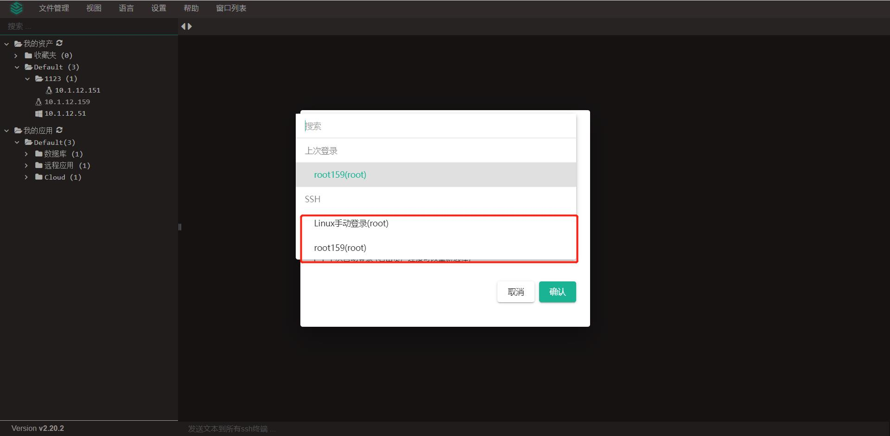
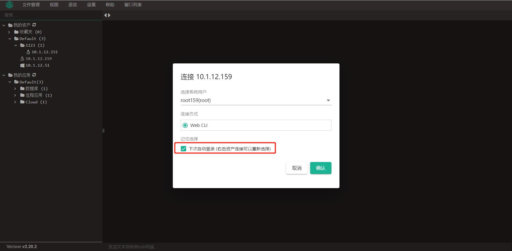
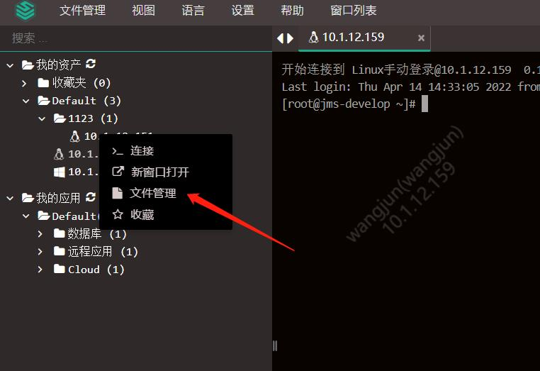
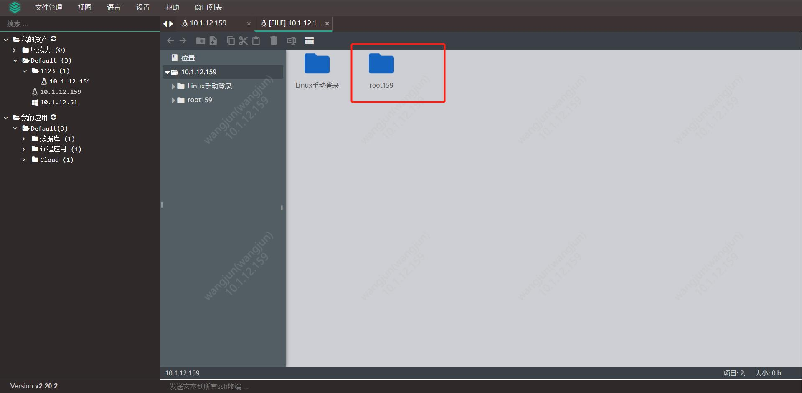

# 文件管理方式的上传下载

!!! tip "如果是手动登陆的资产，请按1-3步骤，先登陆资产，再进行文件管理；如果是自动登陆的资产，可以跳过1-3步骤，直接到4步骤，进行文件管理；"
!!! info "连接资产"
    选择需要登入的资产，左键单击资产名，登陆资产；或者鼠标右键，选择连接。

!!! info "选择系统用户"
    当选择的资产授权了多个系统用户时，则需要手动选择系统用户，会弹出如下弹框：

!!! tip "2.19版本后，如果之前登录过此资产，堡垒机会自动记录之前登录使用的系统用户并自动选择，如下图。"

!!! info "输入密码"
    输入密码后，登入成功；若该系统用户为管理员设置的自动登入用户，则不需要输入密码：

!!! info "登入文件管理"
    登入成功后，在左侧资产树中选择已连接的资产，鼠标右击，选择文件管理，进入文件管理页面。

!!! info "访问资产/tmp目录"
    选择已登入用户的相应目录（例如使用root用户登入，则选择root文件夹），即可使用该系统用户访问到目标资产的/tmp目录。

!!! info "文件下载"
    需先将文件拷贝到/tmp目录下，方可下载。选择需要操作的文件右键点击，即可完成文件下载等操作，双击文件也可实现下载功能。

!!! info "文件上传"
    鼠标右击页面空白处，点击选中文件或者文件夹，进行上传文件，或将文件拖入页面，完成文件上传功能。
