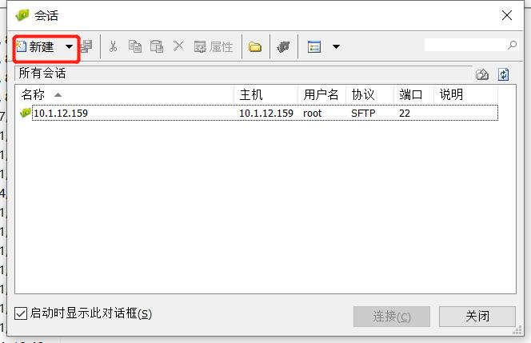
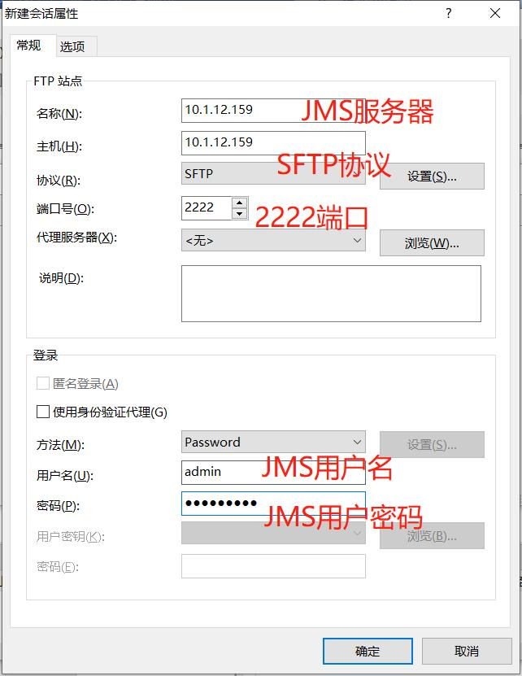
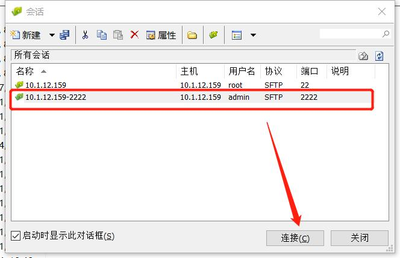
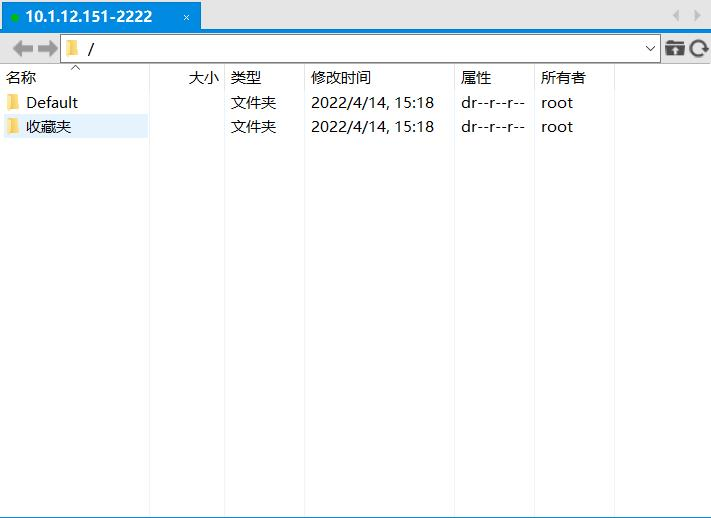
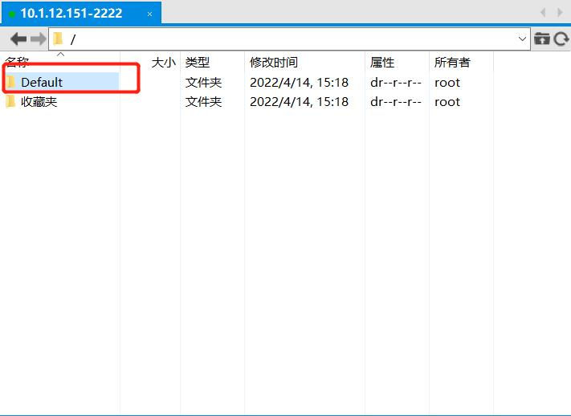
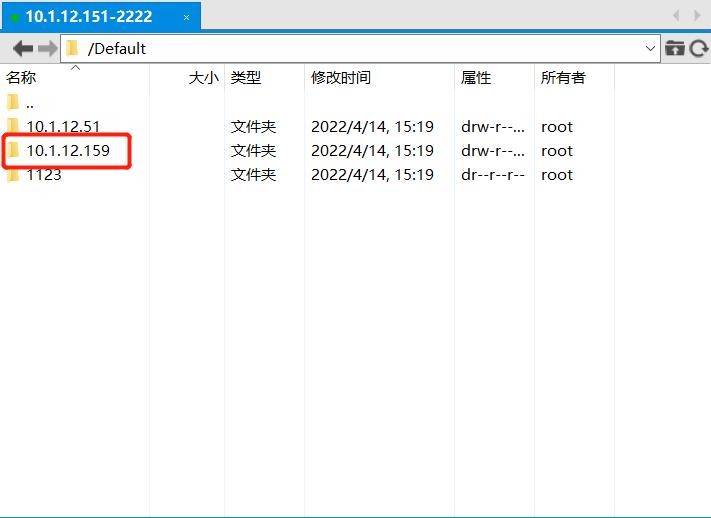
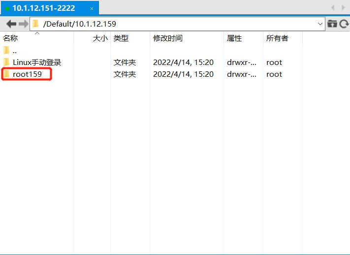
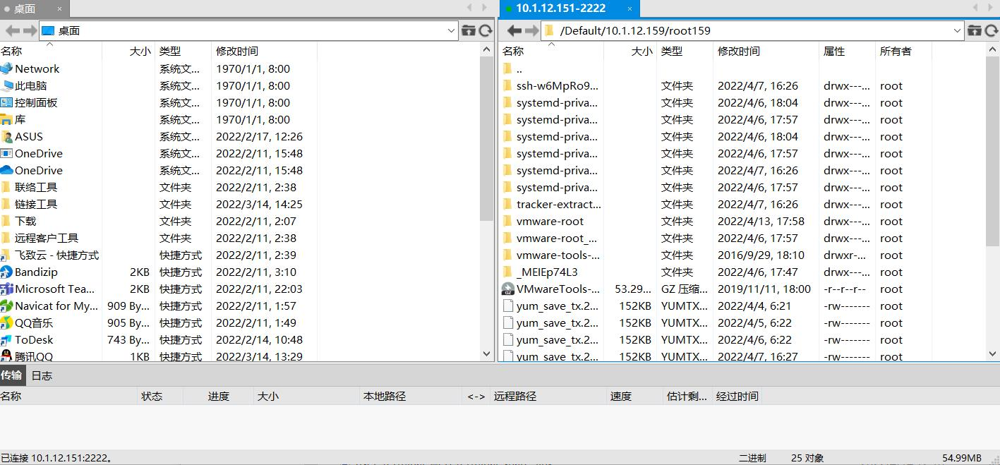

# SFTP工具方式的上传下载

!!! info "1.新建会话，并存入jms用户访问信息；"

!!! tip "如遇到登录后有乱码问题，注意设置选项中的主机类型和编码"

!!! info "2.选定新建的会话后，点击连接"

!!! info "3.登录后的页面为资产节点页面"
    输入密码后，登入成功；若该系统用户为管理员设置的自动登入用户，则不需要输入密码：

!!! info "4.选择节点，选择资产，选择登录的系统用户"
    登入成功后，在左侧资产树中选择已连接的资产，鼠标右击，选择文件管理，进入文件管理页面。

!!! info "5.上传下载按软件默认操作方式进行（xftp工具一般是右键文件进行传输）"
    选择已登入用户的相应目录（例如使用root用户登入，则选择root文件夹），即可使用该系统用户访问到目标资产的/tmp目录。

