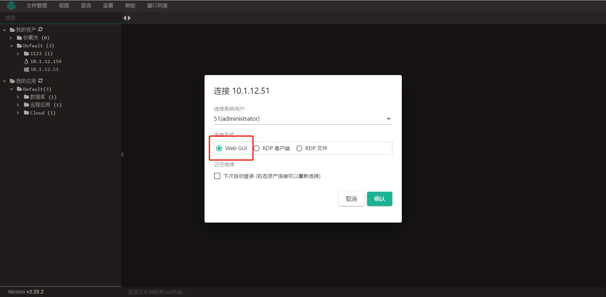
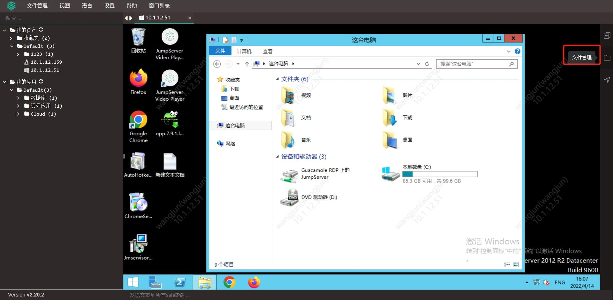
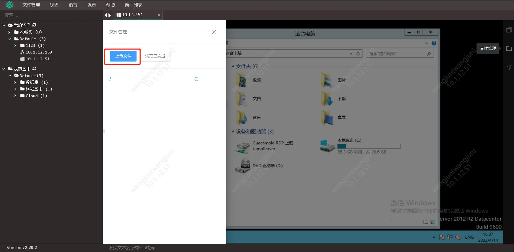
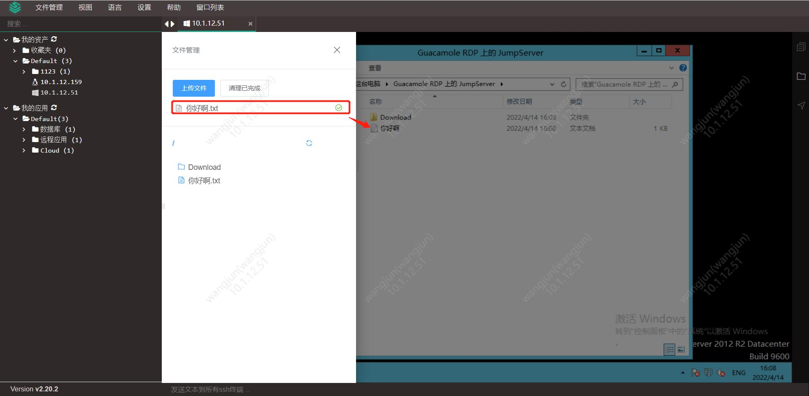
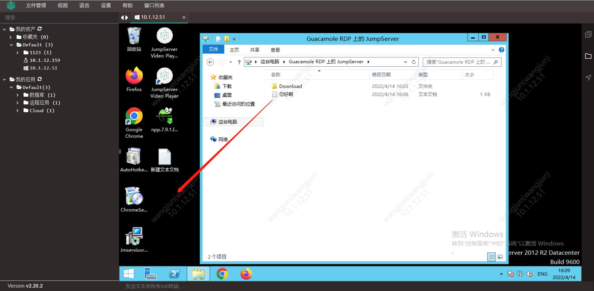
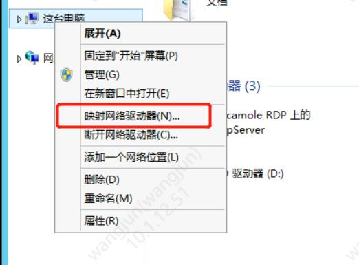
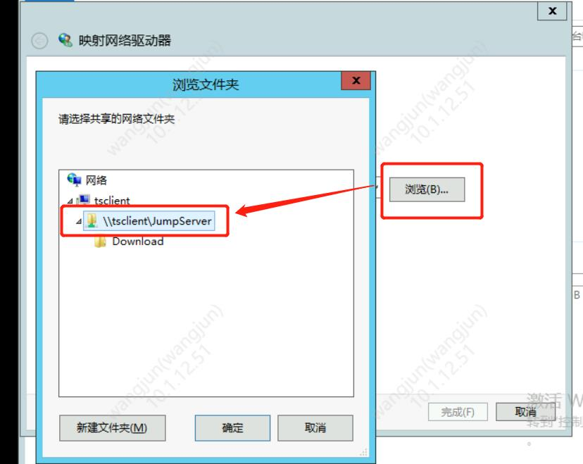

# Web GUI方式的上传下载

!!! info "1.登陆资产：选择Web GUI方式，登陆到会话内；"

!!! tip "以上图方式登录资产后，在我的电脑界面会看到共享盘Guacamole，如下图；"

!!! info "2.文件上传：打开文件管理，点击上传文件，上传完成后可在共享盘中看到这个文件，从共享盘中拖拽到服务器，完成上传。"

!!! info "3.文件下载：打开Download文件夹，可以将资产上的文件拖入Download文件夹，浏览器会自动拉起下载，下载到本地，完成文件的下载（推荐使用Chrome浏览器）。"

!!! tip "如果看不见Guacamole盘可以参考以下内容进行配置。"
!!! info "1.点击“此电脑”右键，选择映射网络驱动器"

!!! info "2. 点击“浏览”，选择 JumpServer ，点击确定，即可映射成功。"

!!! info "3. 若发现目录中没有 Guacamole Filessystem ，请参考这设置开启网络发现功能，并重新登入，刷新重试："
https://jingyan.baidu.com/article/4853e1e5a1e3b41908f7266b.html