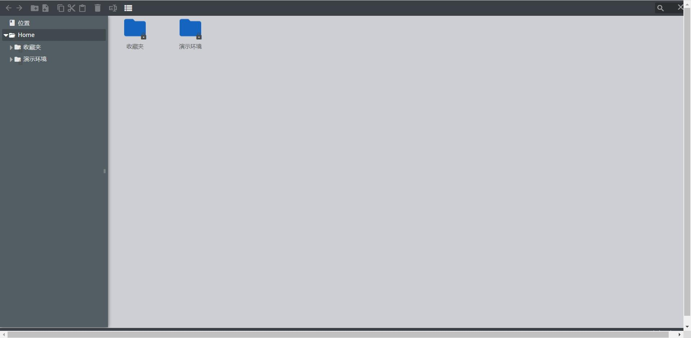

# 文件管理

!!! info "通过 web 连接管理文件"
    在左侧选择资产后, 可以进入管理员预设的资产目录 ( 默认 /tmp ), 可跨资产复制粘贴文件, 目前仅支持 ssh 协议且 系统用户 要求登陆方式为 自动登陆  
    还可使用 `sftp` 命令行登录, 支持 xftp filezilla 等工具
    ```bash
    # ssh -p 2222 用户名@JumpServer_IP地址
    sftp -P 2222 admin@192.168.100.100
    ```



!!! warning "Windows 文件管理"
    Windows 文件上传需要部署 openssh 才可以使用文件管理功能。或者直接在页面右侧选择文件上传下载
