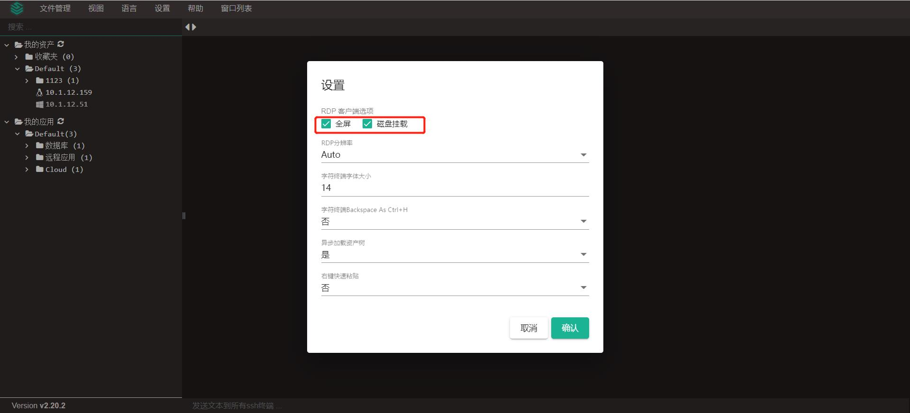
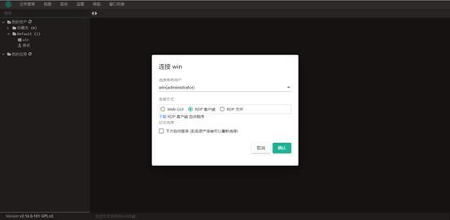

# Web终端设置

!!! info "可以通过“设置”来调整“RDP分辨率”，“字符终端字体大小”，“异步加载资产树”与“快速粘贴”功能"
!!! tip "2.19版本后新增了“Backspace As Ctrl+H”映射设置，为的是解决部分网络设备的回退键失效问题。"

!!! info "全屏和磁盘挂载功能（企业版），在Windows资产使用rdp方式连接时，打开会话时自动全屏，同时挂载本地磁盘到资产内，登录到Web页面后，点击“设置按钮”，选择磁盘挂载。"

!!! info "下载RDP客户端（在连接Windows资产时，选择RDP客户端，下方自动弹出下载按钮）。"

!!! info "点击下载之后，安装需要的版本"

!!! info "进入资产的”此电脑“后，可以查看是否挂载成功。"
